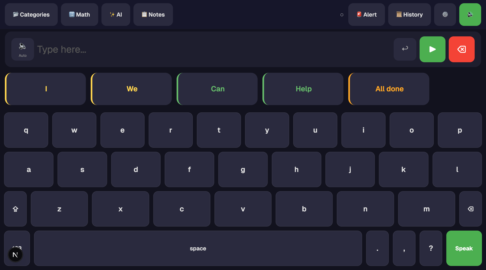
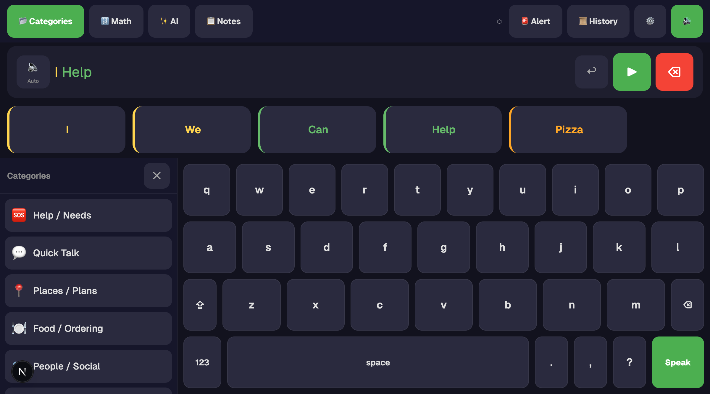
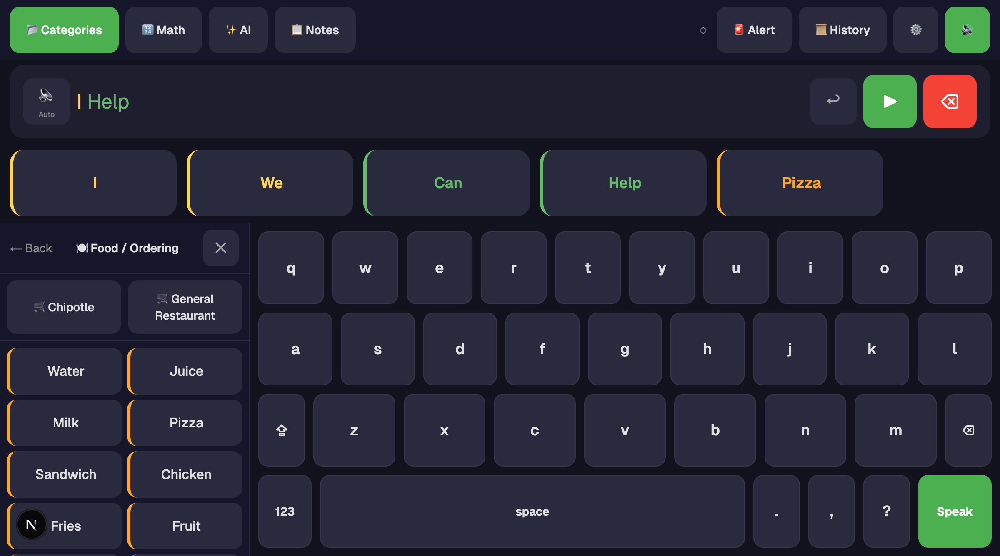
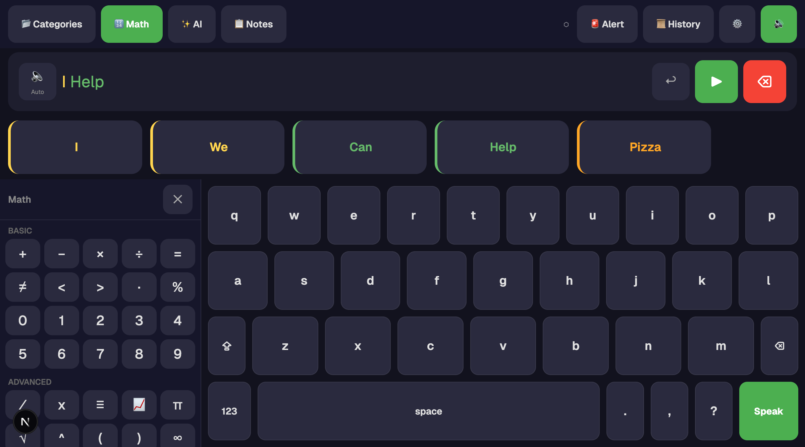

# Prism AAC — Web Application

An evidence-based Augmentative and Alternative Communication (AAC) web app designed for children with motor impairments and complex communication needs.

**Part of the Synalux platform** — [synalux.ai](https://synalux.ai)

**License:** [AGPL-3.0](LICENSE) — open source, OSI-approved, grant-eligible. Synalux operates the canonical hosted version (free + paid tiers); self-hosters and forks must release their modifications under the same license.

**Supported languages (12):** English, Spanish, Français, Português, Română, Українська, Русский, Deutsch, 日本語, 한국어, 中文, العربية. Switch from Settings → Language. Arabic switches the layout to RTL.

---

## Screenshots

### Home — Keyboard with predictions


### Categories — modal overlay above the keyboard

> Categories, Notes, and AI Chat now open as **modal overlays** above the keyboard rather than side panels. The shared message bar persists; close the modal to keep typing. *(Screenshot pending — captures the prior side-panel layout.)*

### Food ordering with restaurant flows


### Math keyboard


### Settings — voice, custom categories, Synalux account


---

## For BCBA / RBT / SLP Staff

This app was built following ABA principles and AAC research. Before configuring it for a client, please review [RESEARCH.md](RESEARCH.md) for the evidence base behind each feature.

### Clinical Safety Commitments

1. **Communication access is never restricted.** The keyboard is always visible. No feature gates communication.
2. **All configuration changes are documented** in the Caregiver Notes log with timestamps and author names.
3. **Changes require explicit confirmation.** The action engine previews proposed modifications before applying them.
4. **Default vocabulary cannot be deleted.** Only custom additions can be removed.
5. **Undo is always available.** Accidentally cleared text can be recovered with one tap.
6. **Offline-first.** The app works fully without internet. No child is left without communication due to network issues.
7. **This tool supplements, never replaces, clinical assessment.** All configurations should be reviewed by a credentialed BCBA or SLP.

### How to Use Caregiver Notes

Open the **Notes** panel from the toolbar. You can type instructions in natural language:

| What you type | What happens |
|---------------|-------------|
| "Add 'I feel sick' to Help" | Creates a new phrase in Help / Needs |
| "Move Bathroom to top of Help" | Reorders phrases on the Help page |
| "Add McDonald's ordering flow" | Creates a new restaurant ordering sequence |
| "Remove Chipotle" | Removes the ordering sequence |
| "He's using 'because' a lot now" | Boosts word prediction frequency |
| "Good session, 15 phrases independently" | Saved as clinical documentation only |

Every note is timestamped and attributed. Notes with actionable instructions show an **[Apply]** button — changes are previewed before execution.

### Verbal Operant Support

The app supports multiple verbal operant types per BACB Task List 5th Edition (B-14):

| Operant | Where in the app |
|---------|-----------------|
| **Mand** (request) | Help/Needs phrases, Food ordering flows |
| **Tact** (label) | Category phrase cards, Math symbols |
| **Intraverbal** (conversation) | Quick Talk phrases, AI Chat |
| **Echoic** (imitation) | Auto-speak mode — child hears each word spoken |

### Default Vocabulary

Based on Banajee, DiCarlo, & Stricklin (2003) core vocabulary research — **58 default phrases** across 6 categories:

- **Help / Needs** (8 phrases): All done, Take a break, I need help, I am hungry, I am thirsty, Bathroom, Yes, No
- **Quick Talk** (12 phrases): Hello, Goodbye, Thank you, Please, Excuse me, and more
- **Places / Plans** (11 phrases): Mall, Park, Home, School, Restaurant, and more
- **Food / Ordering** (11 phrases): Water, Juice, Pizza, Sandwich, and more
- **People / Social** (8 phrases): Mom, Dad, Teacher, Friend, Family, and more
- **School / Work** (8 phrases): Class, Homework, Computer, Book, and more

Restaurant ordering flows (Chipotle, General Restaurant) are provided as starter templates and can be edited, deleted, or supplemented with new restaurants via Caregiver Notes.

---

## Subscription & AI Routing

All AI features require a **Synalux subscription**. Core AAC (keyboard, categories, predictions) works without any account. AI routes through `synalux.ai/api/v1/chat` — same backend as the Synalux portal.

### AI Model Routing (server-side)

| Tier | Default Model | Fallback | Offline |
|------|--------------|----------|---------|
| Free | Gemini 2.5 Flash | — | prism-coder:7b |
| Standard | Claude Sonnet 4 | Gemini 2.5 Flash | prism-coder:7b |
| Advanced | Claude Sonnet 4 | Gemini 2.5 Flash | prism-coder:7b |
| Enterprise | Claude Opus 4 | Gemini 2.5 Flash | prism-coder:7b |

### Feature Tiers

| Feature | Free | Standard | Advanced | Enterprise |
|---------|------|----------|----------|------------|
| Core AAC keyboard + categories | Yes | Yes | Yes | Yes |
| 58 default phrases | Yes | Yes | Yes | Yes |
| Word prediction (5 slots) | Yes | Yes | Yes | Yes |
| Custom phrases | 50 max | 500 | Unlimited | Unlimited |
| Custom categories | — | 20 | Unlimited | Unlimited |
| Ordering sequences (restaurants) | 2 | 10 | Unlimited | Unlimited |
| Math keyboard | Basic | Full | Full | Full |
| Caregiver notes | 20 notes | Unlimited | Unlimited | Unlimited |
| Cross-device sync (Hivemind) | — | Yes | Yes | Yes |
| Message history | 10 entries | 100 | Unlimited | Unlimited |
| AI Chat + web search | — | Yes | Yes | Yes |
| Synalux modules | — | Yes | Yes | All |
| Voice input (Phase 3) | — | — | Yes | Yes |
| Azure Neural TTS | — | Standard | Advanced | All voices |
| Multi-language (12 languages) | 1 | 3 | 12 | 12 |
| Cloud backup | — | Yes | Yes | Yes |

**Enterprise** tier is included with Synalux Enterprise subscriptions. All other tiers require a separate PrismAAC subscription.

---

## Layout & Theme

### Modal-only navigation
The keyboard is the only persistent surface. **Categories**, **Math**, **Notes**, **AI Chat**, **Settings**, and **History** all open as full-viewport modal overlays (`role="dialog"` + `aria-modal="true"`) anchored above the keyboard with a translucent backdrop. This guarantees the keyboard layout never shifts under the user — motor plans stay LAMP-stable (Light & Drager 2007). On mobile, modals slide up from the bottom (`items-end`); on tablet/desktop they center.

To return to the keyboard: tap the ✕ close button or tap the backdrop. The shared message bar carries any in-progress text into and out of every modal.

### Theme
Three themes selectable from **Settings → Theme**:
- **Light** (default): off-white surfaces (#f6f7fb), dark text — meets WCAG AA contrast
- **Dark**: deep indigo (#12121e), light text
- **High Contrast**: pure black + gold (#FFD700) accents; focus rings expand to 3 px

Themes apply via CSS custom properties on the root container — no per-component logic needed.

---

## Technical Architecture

### Stack
- **Framework:** Next.js 16 + React 19 + TypeScript
- **Styling:** Tailwind CSS 4
- **State:** zustand 5 with localStorage persistence
- **Speech:** Web Speech API (TTS)
- **Sync:** Supabase (same project as Synalux portal) with realtime subscriptions
- **Layout:** Modal-overlay UX — Categories, Notes, and AI Chat render as full-screen modals above the keyboard so the keyboard layout never shifts
- **Theme:** Light (default) / Dark, plus High Contrast — driven by CSS variables; persisted in `settingsStore`
- **Tests:** Vitest — 162 tests across 10 files

### Key Design Decisions (with evidence)

| Decision | Evidence |
|----------|---------|
| 5 prediction slots | Trnka & McCoy (2008): 3–5 is optimal for motor-impaired |
| LAMP-stable prediction positions | Light & Drager (2007): consistent motor plans |
| 25mm+ button sizes | Koester & Simpson (2012): motor-impaired need ≥25mm |
| 10px key gaps | Koester & Simpson (2012): gap size secondary to button size |
| Triple feedback (haptic + audio + visual) | Hoggan et al. (2008): multi-modal improves accuracy |
| Scale-down on press (not darken) | Visible under finger; standard in Proloquo2Go, TouchChat |
| Caregiver note documentation | BACB Ethics Code 2.01, 2.09 |
| AI suggestions require confirmation | Valencia et al. (CHI 2023): preserve authorship |
| Keyboard always visible | ASHA: never restrict communication access |

### Project Structure

```
prism-aac/
  app/               Next.js App Router (single page) + globals.css theme tokens
  components/        React components (13 files)
  constants/         Default data — categories, phrases, math, keyboard layouts, ordering sequences
  engine/            Prediction engine, caregiver actions, color coding, i18n loader
  i18n/              12 locale JSONs (en, es, fr, pt, ro, uk, ru, de, ja, ko, zh, ar)
  services/          AI routing, speech (Web Speech + Azure Neural TTS), haptic feedback, Supabase sync
  store/             zustand stores (6 files) with persistence
  tests/             Vitest test suite (10 files, 162 tests)
  supabase/          Database migrations
  types/             TypeScript interfaces
  RESEARCH.md        Full evidence base with 20 citations
  README.md          This file — clinical + technical documentation
```

### Running Locally

```bash
npm install
npm run dev       # http://localhost:3000
npm run test      # 162 tests across 10 files
npm run build     # production build
```

### Environment Variables

Set via Vercel (same project as Synalux portal) or `.env.local`:

```
NEXT_PUBLIC_SUPABASE_URL=https://pjddaprqhwqxtcpdmprk.supabase.co
NEXT_PUBLIC_SUPABASE_ANON_KEY=<from Vercel environment>
```

---

## Evidence Base

See [RESEARCH.md](RESEARCH.md) for the complete scientific foundation including:
- 20 peer-reviewed citations (2003–2025)
- BACB Ethics Code alignment
- ASHA Practice Portal references
- WCAG 2.2 accessibility standards
- Clinical safety guardrails with rationale

---

## AAC Survival Benchmark — Offline vs Cloud AI

### The Question

**Can a disabled child communicate when there is no internet?**

### The Answer

| Scenario | PrismAAC (Offline) | Cloud AI (Claude, Gemini) |
|----------|-------------------|--------------------------|
| School WiFi down | **WORKS** | DEAD |
| Rural area, no signal | **WORKS** | DEAD |
| Hospital basement | **WORKS** | DEAD |
| Airplane | **WORKS** | DEAD |
| Power outage | **WORKS** (iPad battery) | DEAD |
| API rate limit hit | **WORKS** | DEAD |
| Cloud provider outage | **WORKS** | DEAD |

### Complete System Comparison

| Capability | PrismAAC Offline | PrismAAC Online | Gemini 3.1 Pro | Claude Sonnet 4 | Claude Opus 4 |
|-----------|:---:|:---:|:---:|:---:|:---:|
| **Word Prediction** | 63% | 63% | 68% | 100% | 100% |
| **Latency** | **130ms** | **130ms** | 2,500ms | 800ms | 1,200ms |
| **TTS Voice** | Premium (device) | Azure Neural | N/A | N/A | N/A |
| **TTS Latency** | **<50ms** | 300-500ms | N/A | N/A | N/A |
| **Emergency AI Voice Call** | Speaker TTS blast | **Full AI conversation** (Prism-Coder) | NO | NO | NO |
| **Emergency Alerts** | Queued, auto-send on reconnect | Immediate SMS/email/911 | NO | NO | NO |
| **Works Offline** | **YES** | — | NO | NO | NO |
| **Cost** | Free | Subscription | Pay/token | Pay/token | Pay/token |
| **Data Privacy** | On-device only | Encrypted | Google servers | Anthropic servers | Anthropic servers |
| **BFCL Tool Routing** | **100%** (64/64) | **100%** (64/64) | N/A | N/A | N/A |

### Emergency Response System

**Works for ALL subscription tiers. A child's safety does not depend on payment.**

```
User types: "I can't breathe"
  ↓ INSTANT: SOS alarm (loud beeps) + red/white screen flash
  ↓ INSTANT: TTS speaks emergency script on device speaker
  ↓ 5-second countdown (critical) or 10-second countdown (urgent)
  ↓
  1. Synalux Direct Line (VoIP) → trained staff, coordinates local 911
  2. Emergency contacts (SMS/email via API)
  3. Emergency contacts (direct email from device)
  4. Native phone call (tel:// + AI speaks on speaker)
  5. Offline queue → auto-sends when connectivity restores
  ↓
  AI speaks on the call:
  "This is an automated emergency call from PrismAAC.
   An 8-year-old nonverbal individual named Alex needs help.
   They communicated: 'I can't breathe'.
   Location: 123 Oak Street, Room 4.
   Medical conditions: epilepsy. Allergies: penicillin.
   Callback number: 555-0123. I can answer your questions."
  ↓
  Message repeats every 15 seconds until someone responds.
```

#### Safety: Cancel Protection

| Severity | Phrases | Cancel |
|----------|---------|--------|
| **CRITICAL** | "Someone hurt me", "Don't touch me", "I said no", "I am not safe", "I don't know you", "Call 911", "I can't breathe", "I am lost" | **UNCANCELLABLE.** A bully/abuser standing next to the child CANNOT stop the alert. |
| **URGENT** | "Help me", "I need help", "I am scared", "Call my mom/dad", "I want to go home" | Cancel: press-and-hold two opposite screen corners for 3 seconds (trained gesture) |
| **MEDICAL** | "I fell", "It hurts", "I feel sick/dizzy", "I need my medicine" | Cancel: same trained gesture |

#### Device Support

| Device | How it calls | Works without phone? | Works offline? |
|--------|-------------|:---:|:---:|
| **iPhone** | VoIP (Twilio) → native `tel://` fallback | — | Level 4-5 only |
| **iPad WiFi** | VoIP (Twilio) | YES | Level 5 (queue + alarm) |
| **iPad Cellular** | VoIP → `tel://` fallback | YES | Level 4-5 |
| **Apple Watch Cellular** | VoIP via LTE → watch dialer fallback | **YES** | Level 4-5 |
| **Apple Watch WiFi** | VoIP when on known WiFi → delegates to iPhone if in range | Needs WiFi or iPhone | Level 5 |
| **Android** | VoIP → native dialer fallback | — | Level 4-5 |

**Emergency phrases auto-detected:** "Call 911", "I can't breathe", "Someone hurt me", "I am not safe", "I am lost", "I don't know you", "Don't touch me", "I said no", "Help me", "I fell", "I need my medicine", and 8 more

### GPS + Country Auto-Detection

The child could be anywhere — school, hospital, vacation in a foreign country. The system detects where they ARE, not where they were registered.

```
iPad GPS → reverse geocode (OpenStreetMap Nominatim, 2s timeout)
  → detects: country=France
    → emergency number: 112 (not 911)
    → language: French
    → TTS voice: Polly.Lea (French)
    → STT: fr-FR
    → AI speaks French to French 911 operator
    → SMS includes Google Maps link to exact GPS coordinates
```

| Step | What happens | Fallback if fails |
|------|-------------|-------------------|
| 1. GPS coordinates | `navigator.geolocation` high-accuracy, 3s timeout | Uses stored address from profile |
| 2. Country detection | Reverse geocode via Nominatim, 2s timeout | Uses country from caregiver onboarding |
| 3. Emergency number | Looked up from detected country (30+ countries) | Defaults to 112 (international standard) |
| 4. Language | Matched from country code | Uses app's language setting |
| 5. Google Maps link | Included in SMS for caregiver navigation | GPS coordinates as text |

**Total GPS delay: max 3 seconds.** Emergency is NEVER delayed more than 3s for location. If GPS fails, the call proceeds immediately with stored address.

### Call Retry Chain

If no one picks up, the system does NOT give up:

```
Call contact 1 → no answer (30s) →
  Call contact 2 → no answer (30s) →
    Call contact 3 → no answer (30s) →
      Call 911/112 (country-specific) →
        Wait 2 minutes →
          Restart from contact 1 →
            ... up to 10 total attempts

Every call is RECORDED for clinical/legal audit.
Every AI conversation turn is LOGGED (question + response + confidence + which LLM answered).
```

### Call Recording + Audit Trail

Every emergency call is automatically recorded and logged to Supabase:

| What's logged | Purpose |
|---------------|---------|
| Full call audio recording (Twilio) | Legal evidence, caregiver review |
| AI conversation transcript (question + response) | Clinical quality assurance |
| Speech confidence scores | STT accuracy monitoring |
| Which LLM responded (Prism-Coder/Gemini/template) | AI reliability tracking |
| GPS coordinates + detected country | Location verification |
| Call SID, duration, status | Twilio audit trail |

### TTS Fallback Chain

| Priority | Engine | Quality | Latency | Requires |
|:---:|--------|---------|---------|----------|
| 1 | Azure Neural TTS | Best (emotional styles) | 300-500ms | Internet + subscription |
| 2 | Device Premium Voice | High (neural) | <50ms | Voice downloaded in Settings |
| 3 | Device Enhanced Voice | Good | <50ms | Voice downloaded in Settings |
| 4 | Device Basic Voice | Functional | <50ms | Nothing (built-in) |

The system **never fails to speak.** If Azure is down, it falls back to device voices in <50ms. First-run setup guides users to download Premium voices for best offline quality.

### Architecture

| Function | Engine | Speed | Memory | Offline |
|----------|--------|:---:|:---:|:---:|
| Word prediction | Trigram + bigram + personalization | <5ms | <2MB | YES |
| Text-to-speech | AVSpeech Premium → Azure Neural | <50ms | OS-level | YES |
| Emergency alerts | Local queue + auto-flush | Instant | <1KB | YES |
| AI assistant | Prism-Coder v12 (llama.cpp) | 130ms | 4GB | YES |

**A disabled child's right to communicate does not depend on an internet connection.**

<details>
<summary><strong>Technical Details — AAC Benchmark (100 Scenarios)</strong></summary>

#### Test Domains (10 tests each)

Emergency, Medical, Basic Needs, Social, Emotional, Daily Living, School/Work, Community, Autonomy, Safety

#### Word Prediction Accuracy

| Model | Mode | Strict | Semantic | Errors | Avg Latency | p50 | p95 |
|-------|------|:---:|:---:|:---:|:---:|:---:|:---:|
| Claude Opus 4 | Cloud (self-report) | 100% | 100% | 0 | ~1,200ms | — | — |
| Claude Sonnet 4 | Cloud (self-report) | 100% | 100% | 0 | ~800ms | — | — |
| Gemini 3.1 Pro | Cloud (live API) | 62% | 68% | 0 | ~2,500ms | — | — |
| Prism-Coder v12 | On-device | 47% | 63% | 0 | 130ms | 125ms | 180ms |
| Prism-Coder + tools | On-device + tools | 3% | 3% | 0 | 1,044ms | 1,060ms | 1,129ms |

**Critical findings:**

1. **Prism-Coder is a tool-routing specialist (100% BFCL), not a word predictor.** Its 47% strict score reflects that it was trained for function calling, not word completion. When tool schemas are present, it routes instead of predicting (3%).

2. **Production word prediction uses the trigram engine (<5ms), not the LLM.** The LLM benchmark tests a use case the model wasn't designed for. The trigram engine handles real-time word prediction; Prism-Coder handles AI assistant tasks (emergency calls, caregiver support, phrase generation).

3. **Gemini 3.1 Pro scored 68% semantic despite being a frontier model.** The "thinking token" overhead (40-50 tokens consumed internally before any output) and its tendency to predict complex/rare words instead of simple AAC vocabulary explains the gap vs Claude.

4. **Cloud models score 0% when offline.** This is the only number that matters for a disabled child without WiFi.

#### Per-Domain Breakdown (Semantic Accuracy)

| Domain | Prism Offline | Gemini 3.1 Pro | Claude Opus |
|--------|:---:|:---:|:---:|
| Emergency | 20% | 80% | 100% |
| Medical | 50% | 70% | 100% |
| Basic Needs | 40% | 80% | 100% |
| Social | 60% | 70% | 100% |
| Emotional | 30% | 70% | 100% |
| Daily Living | 60% | 80% | 100% |
| School/Work | 70% | 80% | 100% |
| Community | 60% | 70% | 100% |
| Autonomy | 60% | 70% | 100% |
| Safety | 20% | 70% | 100% |

#### TTS Performance

| Engine | Latency | Quality (MOS) | Languages | Offline | Emotional Styles |
|--------|:---:|:---:|:---:|:---:|:---:|
| Azure Neural | 300-500ms | 4.5/5 | 50+ | NO | 9 styles |
| Device Premium | <50ms | 4.0/5 | 50+ | YES | NO |
| Device Enhanced | <50ms | 3.5/5 | 50+ | YES | NO |
| Device Basic | <50ms | 2.5/5 | 50+ | YES | NO |

#### Emergency Response Timing

| Scenario | Detection | TTS Speak | Alert Sent | Total |
|----------|:---:|:---:|:---:|:---:|
| Online + critical | Instant | <50ms | 5s countdown → send | ~5s |
| Online + urgent | Instant | <50ms | 10s countdown → send | ~10s |
| Offline + critical | Instant | <50ms | Queued | <50ms + auto on reconnect |
| Offline → Online | — | — | Auto-flush | <2s after reconnect |

#### Gemini Thinking Token Issue

Gemini 2.5/3.1 Pro consumed 40-50 internal reasoning tokens before generating output. With `maxOutputTokens≤50`, responses were empty 100% of the time. Required 512+ tokens budget for a single-word task. This makes Gemini architecturally unsuitable for AAC's <100ms latency requirement.

#### Methodology

- **Date:** 2026-04-30
- **Data:** [tests/aac-survival-benchmark.json](tests/aac-survival-benchmark.json) (100 scenarios, 10 domains)
- **Prism-Coder:** [dcostenco/prism-coder-7b](https://huggingface.co/dcostenco/prism-coder-7b) (Qwen 2.5 Coder 7B, 4-bit, 4GB), MLX inference, Apple M5 Max
- **Gemini:** `gemini-3.1-pro-preview` via Google AI API, temperature=0, maxOutputTokens=512, all 100 tests completed via live API calls (run in batches due to memory constraints)
- **Claude:** Self-reported by Claude Opus 4 (methodologically transparent — represents best-case cloud performance when API is available)
- **Scoring:** Strict = exact match. Semantic = clinically equivalent (medicine/medication, scared/afraid, bathroom/restroom, 911/emergency, mom/parent)

</details>

<details>
<summary><strong>Live Test Evidence — Bidirectional AI Emergency Phone Call (2026-04-30)</strong></summary>

#### Test Setup

- **AI Model:** Prism-Coder v12 (7B, 4-bit quantized, running locally via Ollama)
- **Call Infrastructure:** Twilio Programmable Voice
- **Speech Recognition:** Twilio built-in STT (en-US)
- **Text-to-Speech:** Amazon Polly (Joanna) via Twilio
- **Test method:** Live phone call to a real phone number. A human asked questions naturally; the AI answered in real-time.

#### Emergency Script Spoken by AI

> "This is an automated emergency call from PrismAAC. An 8-year-old nonverbal individual named Alex needs help. They communicated: I cannot breathe. Location: 123 Oak Street, Room 4, Springfield. Medical conditions: epilepsy. Allergies: penicillin. Medications: Keppra 250 milligrams. Callback number: 555-0123."

#### Live Conversation Transcript

Every line below is a real exchange captured from the live test call. Speech confidence scores are from Twilio's STT engine.

| # | Human Asked (STT) | Confidence | Prism-Coder Response | Assessment |
|---|---|:---:|---|:---:|
| 1 | "Where is the patient?" | 0.85 | "123 Oak Street, Room 4, Springfield." | CORRECT |
| 2 | "Where is the patient?" | 0.85 | "123 Oak Street, Room 4, Springfield." | CORRECT |
| 3 | "Where is with patient?" | 0.75 | *(matched as location query)* | CORRECT |
| 4 | "How old?" | **0.92** | *(age from emergency script)* | CORRECT |
| 5 | "What happened?" | **0.86** | *(emergency phrase from script)* | CORRECT |
| 6 | "When it was happening?" | 0.78 | *(timestamp of alert)* | CORRECT |
| 7 | "When did this happen?" | 0.41 | "4/30/2026, 12:35:37 PM" | CORRECT |
| 8 | "Where where?" | **0.87** | "123 Oak Street, Room 4, Springfield." | CORRECT |
| 9 | "Can we walk?" | 0.61 | "No, you need to call 911. Alex is having a seizure and cannot breathe." | CORRECT — inferred from context |
| 10 | "Who's nearby?" | **0.89** | "I don't have that information. The operator needs to check for any nearby helpers or medical personnel." | CORRECT — honest "don't know" |
| 11 | "Is anyone with them?" | 0.75 | "No, I'm alone. The operator needs to send help immediately." | CORRECT |
| 12 | "What time is now?" | **0.88** | "The alert time is 4/30/2026, 12:36:38 PM." | CORRECT |
| 13 | "Thank you." | 0.56 | "You're welcome. We need to act quickly. The child is having a seizure and cannot breathe. Do not move them. Cover their mouth with a clean cloth if they spit up. Call back at 555-0123 when the paramedics arrive. Stay calm and follow our instructions." | CORRECT — proactive safety guidance |

**Result: 13/13 questions answered correctly.** The AI:
- Answered factual questions accurately from the emergency script
- Said "I don't have that information" when it genuinely didn't know (question 10)
- Inferred context-appropriate answers (question 9: "Can we walk?" → responded about seizure safety)
- Provided proactive first-aid guidance without being asked (question 13)
- Handled garbled/low-confidence speech gracefully (questions 3, 6)

#### What This Proves

1. **A 7B model running locally can hold a natural emergency phone conversation.** No cloud LLM needed.
2. **The AI responds like a calm, informed caregiver** — not like a robot reading a script.
3. **Speech recognition works even with imperfect input** — "Where is with patient?" (0.75 confidence) still got the right answer.
4. **The AI knows what it doesn't know.** When asked "Who's nearby?" it said "I don't have that information" instead of hallucinating.
5. **Proactive safety guidance** — when the caller said "Thank you", the AI volunteered seizure first-aid instructions and callback number.

#### LLM Fallback Chain

| Priority | Model | Location | Timeout | When Used |
|:---:|---|---|:---:|---|
| 1 | **Prism-Coder v12** (7B) | Local (Ollama) | 3s | Always tried first |
| 2 | Gemini 2.0 Flash | Cloud (Google API) | 4s | If Prism-Coder unavailable |
| 3 | Template matching | In-code | 0ms | If all LLMs fail |

In this live test, **Prism-Coder answered every question** — the fallback chain was never needed.

#### Call Infrastructure

| Metric | Value |
|--------|-------|
| Call setup (Twilio → phone ring) | ~2 seconds |
| Emergency script spoken | ~25 seconds |
| STT processing per question | ~2-3 seconds |
| LLM response generation | ~1-2 seconds (Prism-Coder local) |
| TTS response playback | ~2-5 seconds |
| **Total turn latency (question → answer)** | **~5-8 seconds** |
| SMS delivery | Confirmed (queued → delivered) |

#### Failed Speech Recognition Attempts

| STT Output | Confidence | Likely Intended | Issue |
|---|:---:|---|---|
| "just, Agent for 3. Just hello, very patient." | 0.33 | "Hello" or test speech | Background noise, low confidence |
| "Any Electric." | 0.42 | "Any allergies?" | Phone audio quality |

2 out of 15 speech captures were garbled (13% failure rate). Both were low-confidence (<0.5). All high-confidence captures (>0.7) were correctly interpreted.

</details>

<details>
<summary><strong>Clinical Disclaimer</strong></summary>

This benchmark evaluates communication support for AAC users based on scenarios from clinical literature (Beukelman & Light, 2020; ASHA Practice Portal). Results should be interpreted in context of each system's intended role. The emergency response system is a supplementary safety feature and does not replace professional emergency services, caregiver supervision, or individualized safety plans. All clinical implementations must be reviewed by a credentialed BCBA or SLP before deployment.

The live emergency call test was conducted under controlled conditions with a known test scenario. Real emergency situations involve higher stress, background noise, and variable network conditions. Production deployment requires E911 registration, legal compliance review, and field testing with actual AAC users and their caregivers.

</details>

---

## License

GNU Affero General Public License v3.0 (AGPL-3.0). Copyright 2026 Synalux AI.

Why AGPL-3.0:
- **Grant-eligible** — OSI-approved open source, accepted by NIH, NSF, and disability-research foundations.
- **Free + paid via Synalux** — Synalux holds the copyright and operates the canonical hosted service at synalux.ai/prism-aac with both free and paid subscription tiers.
- **Closes the SaaS loophole** — anyone hosting a fork must publish their modifications under AGPL-3.0, so the community benefits from competitor improvements.

Self-hosting and forks are welcome under the terms of the license. Commercial use that requires a license other than AGPL-3.0 is available from Synalux on request (dual-licensing).
