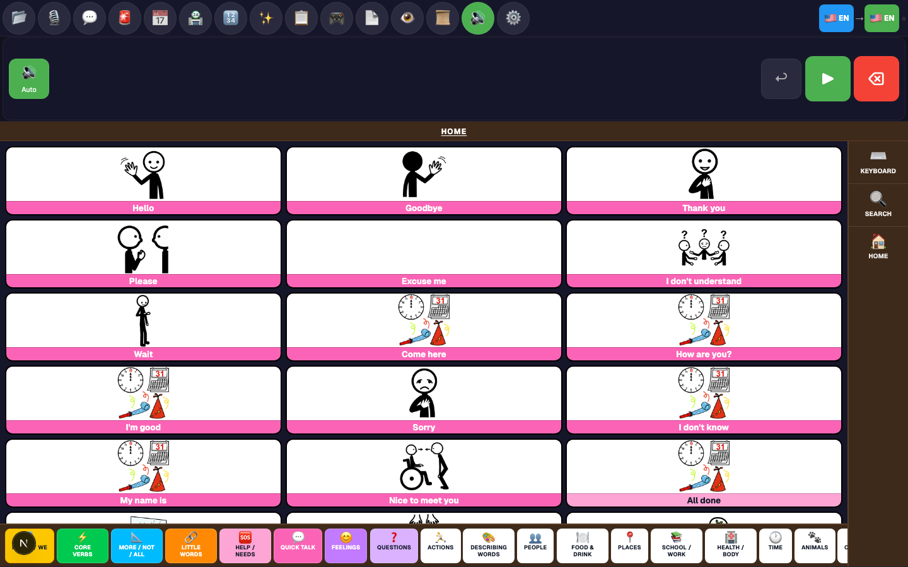
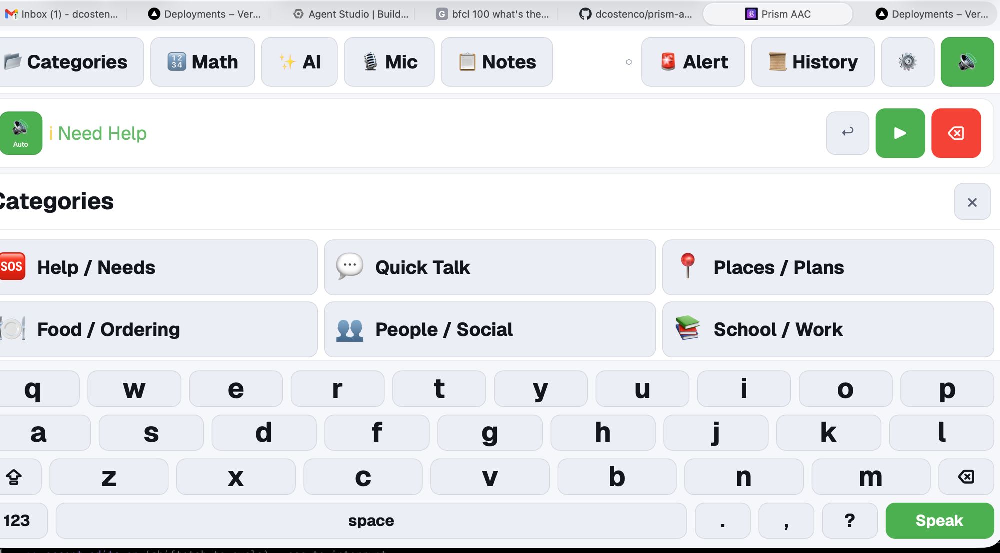
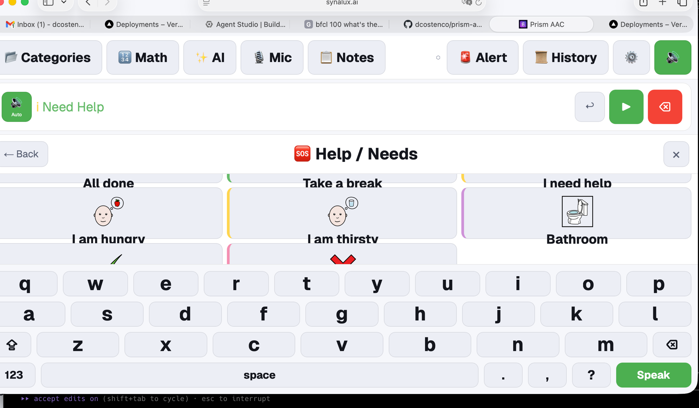
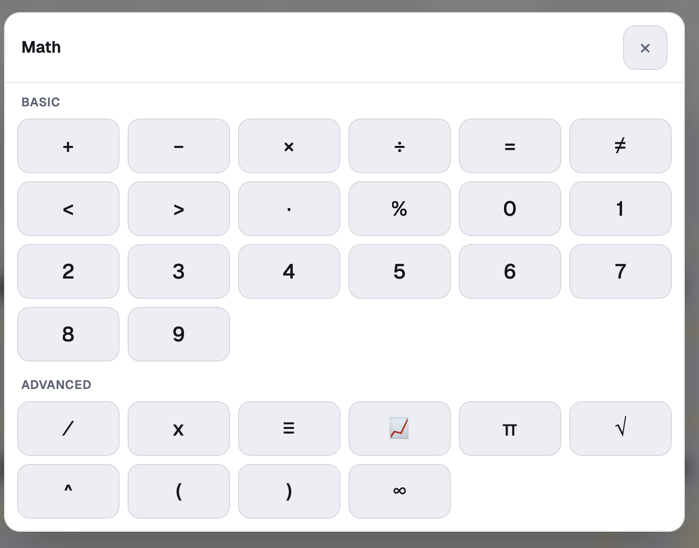
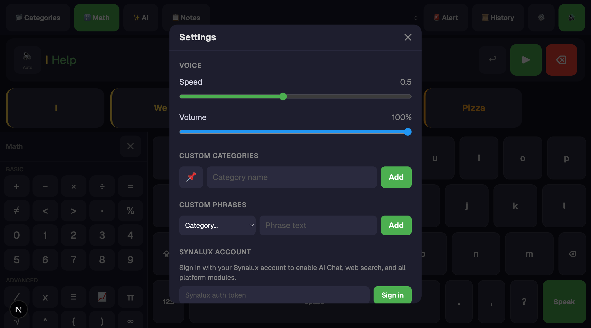
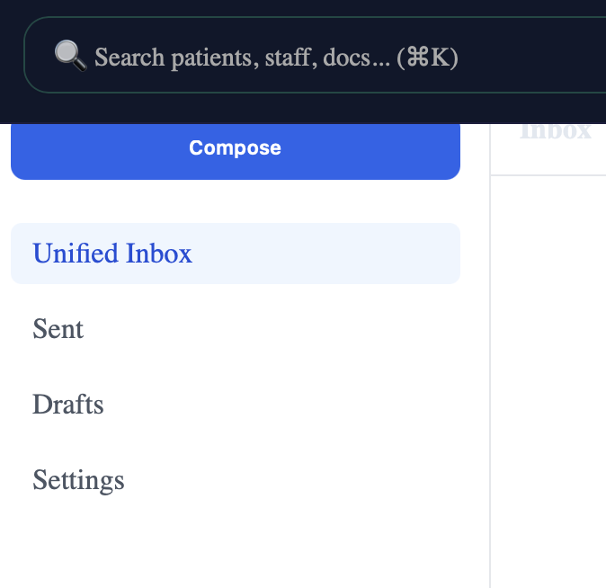

# Prism AAC — Web Application

An evidence-based Augmentative and Alternative Communication (AAC) web app designed for children with motor impairments and complex communication needs.

**Part of the Synalux platform** — [synalux.ai](https://synalux.ai)

**License:** [AGPL-3.0](LICENSE) — open source, OSI-approved, grant-eligible. Synalux operates the canonical hosted version (free + paid tiers); self-hosters and forks must release their modifications under the same license.

---

## 🆕 What's New (May 2026)

### Math panel redesigned — Panther Math Paper-style canvas with KaTeX + drawing
- **Graph-paper canvas (24px grid)** dominates the panel — matches the Panther Math Paper convention proven in classroom AAC use
- **KaTeX rendering** so `5 × 6 =` displays as real math typography (italic variables, true exponents, fraction bars)
- **✏️ Drawing layer** sketches geometric figures directly on the grid (triangles, circles, chord diagrams). Roughly straight strokes auto-snap to grid-aligned segments — no separate ruler tool needed
- **LaTeX template inserters**: `½`, `a/b`, `x²`, `xⁿ`, `xₙ`, `√`, `∛`, `∑`, `∫`, `12+34` (column addition)
- **Compact Panther-style operator row**: `⊕ More` `(2xy)²` `+ − × ÷ =` `✏️` `½` `⌫`. The 8 symbol categories live behind the More button so the canvas stays maximized
- See the [Math section below](#math--panther-math-paper-inspired-graph-paper-canvas-with-ai-tutor) for full details

### Production model upgraded → `prism-coder:7b` v18clean-epoch0 + new `prism-coder:14b` sibling
- **Pareto upgrade over the prior v18aac-MAX prod.** Re-trained from clean Qwen2.5-Coder-7B-Instruct base on the curated v18-clean mix (BFCL backbone + caregiver + text_correct + emergency + translate + ask_ai + format anchor).
- **AAC realigned: 47/48 (97.9%)** held, **caregiver targeted: 20/20** (was 19/20), **translate: 8/8** (was 7/8), all other categories perfect.
- **BFCL median (3-run, StdDev 0%): 88.1%** — +40.9 percentage points over prior prod, restoring tool-calling fluency that v18aac-MAX had partially traded away.
- **NEW `prism-coder:14b` sibling** — Qwen2.5-Coder-14B base + AAC SYSTEM directive, BFCL 85.9%, AAC 46/48 (95.8%), **32K context**. Auto-routed for paid-tier medium-length AAC queries (5–40 words) via Synalux portal — keeps inference local on the cloud GPU pool, $0 marginal cost vs Claude/Gemini.
- **Free tier behaviour unchanged** — still 7B local for simple queries → Gemini for complex ones.
- **Rollback path:** `ollama cp prism-coder:7b-prev-20260504-1325 prism-coder:7b` (< 1 minute, snapshot of prior v18aac-MAX prod).

### Gesture recognition (carries over from previous release)
- **🆕 Gesture recognition support (5/5 spot-check)** — model configures the new 7-gesture facial-blendshape input system, including:
  - Calibration walkthroughs (3-second neutral baseline capture)
  - Asymmetry-safe handling for hemiplegia / Bell's palsy / CP (uses `max(left, right)` for paired blendshapes)
  - Fatigue-aware threshold tuning (10–20% relaxation after 15–30 min)
  - Per-gesture threshold/dwell/cooldown tuning advice
- **Built on** Qwen2.5-Coder-7B-Instruct base with full SFT on caregiver + emergency + text_correct + translate + gesture corpus (~4500 rows). Apache 2.0 / CC-BY-4.0 commercial-safe data.
- **Cloud companion** for paid users on iPad Pro M4 (16 GB) and Synalux online: **`prism-aac:14b`** (DoRA r=384) plus emergency-grade routing to **`prism-coder:72b-v18bfcl`** when online.
- **Rollback ready** — prior v18aac (`prism-coder:7b-prev-*`) and v17.4 are one `ollama cp` away.

### Gesture Recognition System (NEW feature)
- **7 facial gestures** detected via MediaPipe blendshapes: `smile`, `brow_raise`, `brow_lower`, `jaw_open`, `eye_blink_left`, `eye_blink_right`, `head_tilt`
- **11 assignable actions**: confirm, cancel, next, previous, speak, scroll up/down, select, clear, emergency_alert, repeat_last
- **Basic mode**: zero training, works immediately via blendshape thresholds
- **Advanced mode**: DTW template matching + integration with local 8B model for novel gestures
- **Accessibility-first**: per-user calibration, asymmetry-aware detection, jitter filtering, fatigue adaptation
- See `docs/GESTURE_RECOGNITION.md` for full design doc
- See `docs/TRACKING_RELIABILITY.md` for the deep technical investigation: 11 known stability gaps, "military stable in a moving car" requirement, modern best-practice references (Kalman filter, ego-motion correction, confidence-weighted multi-camera fusion, cross-modal lockout), and the prioritized implementation roadmap

<!-- 🌐 Translations auto-generated by scripts/generate_i18n.py — triggered by GitHub Actions on README.md changes -->
🌐 **Translate:** [English](README.md) · [Español](docs/i18n/README_es.md) · [Français](docs/i18n/README_fr.md) · [Português](docs/i18n/README_pt.md) · [Română](docs/i18n/README_ro.md) · [Українська](docs/i18n/README_uk.md) · [Русский](docs/i18n/README_ru.md) · [Deutsch](docs/i18n/README_de.md) · [日本語](docs/i18n/README_ja.md) · [한국어](docs/i18n/README_ko.md) · [简体中文](docs/i18n/README_zh-Hans.md) · [繁體中文](docs/i18n/README_zh-Hant.md) · [廣東話](docs/i18n/README_zh-HK.md) · [العربية](docs/i18n/README_ar.md)

**In-app locales (14, covering 12 spoken languages):** English, Español, Français, Português, Română, Українська, Русский, Deutsch, 日本語, 한국어, **简体中文 (zh-Hans)**, **繁體中文 (zh-Hant)**, **廣東話 (zh-HK)**, العربية. Chinese ships in three variants — Simplified Mandarin (Mainland/Singapore), Traditional Mandarin (Taiwan), and Cantonese (Hong Kong/Macao) — each with its own UI translation, voice, and prediction vocabulary. Switch from Settings → Language. Arabic switches the layout to RTL.

---

## Screenshots

### Home — keyboard, message bar, prediction tiles with pictograms

> Soft keyboard with language-specific layouts (QWERTY, Cyrillic, Arabic, Hiragana, etc.). Five color-coded prediction tiles (Modified Fitzgerald Key) above the keys with ARASAAC pictograms. Proportional clamp()-based sizing scales from iPhone to desktop. Top toolbar carries 10 modules at one tap each.

### Categories — 22 categories with PECS-style phrase tiles

> **4 core word categories** (Pronouns, Verbs, Descriptors, Little Words — 80% of communication) + **18 TouchChat-standard categories** (Feelings, Actions, Questions, Health, Animals, Colors, etc.). 300+ phrases with translations in 12 languages. SLP-recommended progressive vocabulary exposure with category visibility toggles and configurable grid size (4–20 tiles per screen).

### Category detail — PECS format with pictograms

> Phrase tiles use PECS format: pictogram on top, text label on bottom with border separator. Symbols from [ARASAAC](https://arasaac.org/) (12.9k symbols, free); paid tiers get AI-generated pictograms via FLUX.1 Schnell. Full-phrase search with English fallback ensures pictograms appear for all languages.

### Math — Panther Math Paper-inspired graph-paper canvas with AI tutor

> Full-screen graph-paper canvas (24px grid, the Panther Math Paper convention) with KaTeX-rendered typography — variables italicize automatically, superscripts stack as true exponents, fractions display as proper bars (½ not "1/2"). Compact bottom keyboard mirrors Panther exactly: `⊕ More` `(2xy)²` `+` `−` `×` `÷` `=` `✏️` `½` `⌫` over a single 1–0 number row over a small variables strip + Speak.
>
> **Drawing layer** (✏️ pencil): sketch geometric figures directly on the grid — triangles, circles, chords, axes. Roughly straight strokes auto-snap to grid-aligned line segments so a freehand triangle side becomes a clean ruler-quality edge without switching tools. Each stroke is a separate SVG path so undo pops one stroke at a time.
>
> **Templates** (in More): tap `½` for ½, `a/b` for blank fraction, `x²` / `xⁿ` / `xₙ` for exponent and subscript, `√` / `∛` for roots, `∑` for summation, `∫` for integral, `12+34` for column-stacked addition. All KaTeX-rendered live as you type.
>
> **AI Math Tutor** (paid): 💡 Hint (guides without solving), ✓ Check (validates and explains errors gently), 🎓 Solve (step-by-step solution in simple language). TTS reads expressions aloud.
>
> _Screenshot above is from the pre-redesign release; capture a fresh one with `npm run dev` → open Math panel → ⌘⇧4_. Replace `docs/screenshots/math-panel-v2.png`._

### Schedule & Tasks — visual routines with rewards
> **First-Then board** for autistic children — shows current task and next/reward activity. Daily task list with checkmark completion, SVG circular visual timer (1–15 min), and token reward system (earn ⭐ stars). Based on ChoiceWorks and First Then Visual Schedule research.

### Games — therapeutic AAC games with clinical purpose

> **Why games in an AAC app?** For children with complex communication needs, play IS communication practice. Every tap, every word spoken, every sentence built is a manding trial. These aren't reward screens — they're therapy tools disguised as fun.

#### 🫧 Bubble Pop (Free)
> Colorful word bubbles float up against a night-sky gradient. The child taps to pop them — each pop speaks the word aloud via TTS. **Uses the child's OWN vocabulary** from their prediction history, so frequently-used words get more practice. Difficulty scales: more bubbles, faster float speed each level. Sparkle animations on pop.
>
> **Clinical purpose:** Cause-and-effect learning + manding practice with personal vocabulary. The child hears their own most-used words reinforced through play.

#### 🎨 Color Hunt (Free)
> Big, bright color tiles fill the screen. The app speaks "Find Red!" and the child taps the matching tile. Grid grows from 4 to 8 tiles as the child succeeds. Immediate visual feedback (star animation) + spoken confirmation ("Yes! Red!").
>
> **Clinical purpose:** Receptive language (understanding spoken words), color vocabulary, listener responding skills. Follows discrete trial teaching structure: SD (spoken instruction) → R (tap response) → SR+ (praise + animation).

#### 📖 My Story (Free)
> Picture cards organized in 4 color-coded categories: **Who** (I, Mom, Dad) → **Does what** (want, go, eat, play) → **What** (water, food, ball, book) → **Where** (home, park, school). The child taps cards left-to-right to build sentences like "I want water" or "Mom go park", then taps Speak to hear the full sentence.
>
> **Clinical purpose:** Sentence construction, carrier phrases, manding with multi-word utterances. Mirrors the PECS Phase IV progression (sentence strip). Category colors follow Modified Fitzgerald Key conventions.

#### 🔍 Match It (Paid)
> TTS says "Find the dog!" — child picks the correct emoji from 4 choices. Grid grows with level. 12 items: 🐕🐱🚗🏠🌳🐟🐦🌸☀️🌙⭐🍎
>
> **Clinical purpose:** Receptive identification / listener responding. Discrete trial structure (SD → R → SR+). Maps to VB-MAPP Listener Responding milestones.

#### ❓ Yes or No (Paid)
> Shows an emoji + asks "Is this a cat?" (50% correct, 50% mismatch). Child taps big ✅ Yes or ❌ No buttons. TTS speaks the question and feedback.
>
> **Clinical purpose:** Conditional discrimination — child must evaluate the match, not just recognize. Builds yes/no responding (a critical AAC skill many children lack).

#### 💬 Finish It (Paid)
> Carrier phrase "I want ___" with 4 picture choices. Rotates through "I want", "I see", "I like", "Give me" frames. Child taps to complete the sentence, then hears it spoken.
>
> **Clinical purpose:** Manding with sentence frames. Mirrors PECS Phase IV sentence strip. Functional Communication Training (FCT) — building multi-word requests.

#### 🗂 Category Sort (Paid)
> Item appears at top — child taps which category it belongs to: 🍎 Food, 🐾 Animals, 👕 Clothing, or 🏠 Places. 16 items, 4 per category. Immediate TTS feedback.
>
> **Clinical purpose:** Feature-Function-Class (FFC) categorization. Core ABLLS-R and VB-MAPP milestone. Prerequisite for advanced tacting and intraverbal skills.

#### 🎭 Emotion Match (Paid)
> Scenario text appears ("Birthday party!", "Lost my toy"). Child picks the matching emotion: 😊 Happy, 😢 Sad, 😨 Scared, 😡 Angry, or 😲 Surprised. 10 scenarios, 2 per emotion.
>
> **Clinical purpose:** Tacting emotions / private events (Skinner's verbal behavior). Social-emotional vocabulary. Critical for children with autism who struggle with emotion identification.

#### 📋 What Comes Next (Paid)
> Shows 2 pictures in sequence (😴 wake up → 🪥 brush teeth → ?). Child picks the 3rd step from choices. 6 daily routine sequences.
>
> **Clinical purpose:** Temporal sequencing and transitional knowledge. Maps to ABLLS-R Visual Performance and daily living skills domains.

#### 👀 Same & Different (Paid)
> Shows 3+ emoji items — 2 are the same, 1 is different. Child taps the odd one out. Grows from 3 to 7 items. 5 thematic pools (animals, food, sports, vehicles, flowers).
>
> **Clinical purpose:** Visual discrimination — prerequisite for matching, sorting, and reading readiness. ABLLS-R Visual Performance B1-B12.

#### 🔊 I Hear It (Paid)
> TTS describes an animal or object ("This animal says meow"). Child taps the matching picture from 4 choices. 12 clue items with descriptive sentences.
>
> **Clinical purpose:** Auditory comprehension — listener responding by feature. Child must process verbal information and map it to visual representation.

#### 🎲 Turn Taker (Paid)
> Dice-rolling game with "My turn!" / "Your turn!" prompts. Child taps to roll ⚀⚁⚂⚃⚄⚅, then waits while the other "player" rolls automatically. Running score for both.
>
> **Clinical purpose:** Turn-taking and social communication. Natural Environment Teaching (NET). Teaches waiting, shared attention, and reciprocal interaction vocabulary.

**Free games (1-3):** Bubble Pop, Color Hunt, My Story — full AAC keyboard vocabulary practice, no payment gate on communication.

**Paid games (4-12):** Match It, Yes/No, Finish It, Category Sort, Emotion Match, What Comes Next, Same & Different, I Hear It, Turn Taker — structured BCBA-approved skill-building programs targeting specific VB-MAPP/ABLLS-R milestones.

**All 12 games:** gradient backgrounds, 60px+ touch targets, scale animations on tap, TTS on every interaction, level progression, 12-language support.

### Marketplace — Synalux component platform
> Browse and install Synalux modules: Symbol Libraries, Board Templates (Free+), Game Packs, Voice Packs, Picture Editor, Music Composer (Standard+), AAC Designer, Video Composer (Advanced+). Tier-gated with green/lock badges.

### Settings — Synalux account, voice, accessibility, SLP tools

> Category visibility toggles (progressive vocabulary exposure), grid size selector (4–20 tiles), high contrast mode (WCAG AAA — black/yellow), 12 languages, speech rate/volume, custom categories/phrases, Synalux sign-in. All settings translated.

### Synalux Portal Integration: Mail & Drive

> AAC prediction and auto-correction are now integrated directly into the Synalux Portal's "Vibe Interface". This touch-friendly design allows users with motor impairments to compose emails, attach Drive documents, and communicate seamlessly without leaving the platform.

---

## For BCBA / RBT / SLP Staff

This app was built following ABA principles and AAC research. Before configuring it for a client, please review [RESEARCH.md](RESEARCH.md) for the evidence base behind each feature.

### Clinical Safety Commitments

1. **Communication access is never restricted.** The keyboard is always visible. No feature gates communication.
2. **All configuration changes are documented** in the Caregiver Notes log with timestamps and author names.
3. **Changes require explicit confirmation.** The action engine previews proposed modifications before applying them.
4. **Default vocabulary cannot be deleted.** Only custom additions can be removed.
5. **Undo is always available.** Accidentally cleared text can be recovered with one tap.
6. **Offline-first.** The app works fully without internet. No child is left without communication due to network issues.
7. **This tool supplements, never replaces, clinical assessment.** All configurations should be reviewed by a credentialed BCBA or SLP.

### How to Use Caregiver Notes

Open the **Notes** panel from the toolbar. You can type instructions in natural language:

| What you type | What happens |
|---------------|-------------|
| "Add 'I feel sick' to Help" | Creates a new phrase in Help / Needs |
| "Move Bathroom to top of Help" | Reorders phrases on the Help page |
| "Add McDonald's ordering flow" | Creates a new restaurant ordering sequence |
| "Remove Chipotle" | Removes the ordering sequence |
| "He's using 'because' a lot now" | Boosts word prediction frequency |
| "Good session, 15 phrases independently" | Saved as clinical documentation only |

Every note is timestamped and attributed. Notes with actionable instructions show an **[Apply]** button — changes are previewed before execution.

### Verbal Operant Support

The app supports multiple verbal operant types per BACB Task List 5th Edition (B-14):

| Operant | Where in the app |
|---------|-----------------|
| **Mand** (request) | Help/Needs phrases, Food ordering flows |
| **Tact** (label) | Category phrase cards, Math symbols |
| **Intraverbal** (conversation) | Quick Talk phrases, AI Chat |
| **Echoic** (imitation) | Auto-speak mode — child hears each word spoken |

### Default Vocabulary

Based on Banajee, DiCarlo, & Stricklin (2003) core vocabulary research — **300+ default phrases** across 22 categories, all translated in 12 languages:

**Core Words (SLP-recommended — 80% of daily communication):**
- **I / You / We** (14 phrases): I, You, He, She, It, We, They, Me, My, Your, His, Her, This, That
- **Core Verbs** (20 phrases): Want, Like, Have, Do, Can, Need, Know, See, Think, Feel, Say, Tell, and more
- **More / Not / All** (20 phrases): More, Not, No, Yes, All, Some, Up, Down, In, Out, On, Off, Done, Again, and more
- **Little Words** (16 phrases): Is, The, A, And, But, Or, To, For, With, Because, If, When, Where, and more

**Communicative Functions:**
- **Help / Needs** (14 phrases), **Quick Talk** (16 phrases), **Feelings** (14 phrases), **Questions** (12 phrases)

**Fringe Vocabulary (18 TouchChat-standard categories):**
- Actions (24), Describing Words (16), People (14), Food & Drink (18), Places (14), School/Work (14), Health/Body (14), Time (12), Animals (12), Colors (10), Clothes (10), Transportation (10), Weather (8), Toys & Fun (12)

Restaurant ordering flows (Chipotle, General Restaurant) are provided as starter templates.

---

## Subscription & AI Routing

All AI features require a **Synalux subscription**. Core AAC (keyboard, categories, predictions) works without any account. AI routes through `synalux.ai/api/v1/chat` — same backend as the Synalux portal.

### AI Model Routing (server-side)

Identical to the rest of the Synalux platform — all products (Portal, PrismAAC, Prism Coder, VS Code Extension) route through the same `/api/v1/chat` endpoint, and tier policy is enforced server-side. A free-tier client requesting `claude-sonnet-4` is silently downgraded to its tier default; clients can't bypass the gate.

| Tier | Default Model | Fallback | Offline | Daily AI Calls | Max Tokens |
|------|--------------|----------|---------|----------------|------------|
| Free | Gemini 2.5 Flash | — | prism-coder:7b | 100 | 4,096 |
| Standard | Claude Sonnet 4 | Gemini 2.5 Flash | prism-coder:7b | 2,000 | 8,192 |
| Advanced | Claude Sonnet 4 | Gemini 2.5 Flash | prism-coder:7b | 5,000 | 16,384 |
| Enterprise | Claude Opus 4 | Gemini 2.5 Flash | prism-coder:7b | 100,000 | 32,768 |

When the API is unreachable (offline, network drop, regional outage), every tier falls back to `prism-coder:7b` running locally via Ollama — no degradation in core AAC functionality.

### Subscription Pricing

| Tier | Price | Trial |
|------|-------|-------|
| Free | $0 / month | — |
| Standard | $19 / month | 14-day free trial, no credit card required |
| Advanced | $49 / month | 14-day free trial, no credit card required |
| Enterprise | $99 / month | 14-day free trial, no credit card required |

Pricing matches the Synalux Portal and Prism Coder products — one bill, one tier across all platform apps. **Synalux Enterprise subscribers get PrismAAC Enterprise included** at no additional cost.

### Picture mode (TouchChat-style pictograms)

Phrase tiles, category cards, and prediction tiles can render an AAC pictogram next to the words — the visual style that TouchChat HD, Proloquo2Go, and LAMP have used for decades, but with no $250 one-time fee and no per-phrase manual symbol authoring.

Two sources, picked automatically based on your subscription tier (no setting to flip):

- **ARASAAC** ([arasaac.org](https://arasaac.org/)) — open library of ~12,900 AAC pictograms, free for every tier including the Free plan. Lazy-fetched directly from `static.arasaac.org`, browser-cached in IndexedDB after first load.
- **AI fallback (FLUX.1 Schnell via Together AI)** — for any phrase ARASAAC doesn't cover, paid Synalux subscribers get a freshly-generated flat-vector pictogram (~2s, ~$0.003 per image). Generated images are cached **platform-wide in Supabase Storage** keyed by `sha256(version|lang|phrase)` — so every unique phrase generates exactly **once** across the entire user base, ever. The next user to type the same phrase pulls the cached PNG from the CDN at zero cost. Privacy posture: the cache key is content-hashed, the raw phrase is never persisted, and the bucket is anonymous content-addressed.

### Voice input (browser-side speech-to-text)

Both AI Chat and the toolbar carry a 🎙 Mic button on every browser that ships the Web Speech API (Chrome / Edge / Safari). Tap to start continuous recognition; spoken words appear in the message bar exactly as if they were typed on the keyboard. Audio never leaves the device — recognition runs entirely in the browser engine. Available to every tier including Free; the AI response that follows still routes through your tier's model.

### Feature Tiers

| Feature | Free | Standard | Advanced | Enterprise |
|---------|------|----------|----------|------------|
| Core AAC keyboard + 22 categories | Yes | Yes | Yes | Yes |
| 300+ default phrases (translated in 12 languages) | Yes | Yes | Yes | Yes |
| 4 Core word categories (Pronouns, Verbs, Descriptors, Little Words) | Yes | Yes | Yes | Yes |
| Word prediction (5 slots; trigram + bigram + prefix + frequency + recency) | Yes | Yes | Yes | Yes |
| Language-specific keyboard layouts (Cyrillic, Arabic, AZERTY, diacritics) | Yes | Yes | Yes | Yes |
| Modified Fitzgerald Key color coding (Goossens' 1992) — pronouns yellow, verbs green, nouns orange | Yes | Yes | Yes | Yes |
| Live translation [RU]→[EN] with auto-speak | Yes | Yes | Yes | Yes |
| Offline translation dictionary (1,450+ words per language pair) | Yes | Yes | Yes | Yes |
| 10 vocabulary sets (My Core, WordPower, Gateway, Aphasia, etc.) | Yes | Yes | Yes | Yes |
| Per-word visibility toggles | Yes | Yes | Yes | Yes |
| PECS-style symbol cards (black borders, label at bottom) | Yes | Yes | Yes | Yes |
| Export/Import configuration (clipboard JSON) | Yes | Yes | Yes | Yes |
| Cumulative auto-speak | Yes | Yes | Yes | Yes |
| Math Paper-style expression builder + AI Math Tutor | Yes | Yes | Yes | Yes |
| Schedule & Tasks (First-Then board, visual timer, rewards) | Yes (5 tasks) | Yes | Yes | Yes |
| AAC Games — Free (Bubble Pop, Color Hunt, My Story) | Yes | Yes | Yes | Yes |
| AAC Games — BCBA Training (Match It, Yes/No, Finish It, Category Sort, Emotion Match, Sequence, Same/Different, I Hear It, Turn Taker) | — | Yes | Yes | Yes |
| Category visibility toggles + grid size (4–20) | Yes | Yes | Yes | Yes |
| High Contrast mode (WCAG AAA) | Yes | Yes | Yes | Yes |
| Picture mode — ARASAAC pictograms on phrase + prediction tiles | Yes | Yes | Yes | Yes |
| Picture mode — AI-generated pictograms (FLUX.1 Schnell, platform-cached) | — | Yes | Yes | Yes |
| Voice input — continuous browser-side speech-to-text (Web Speech API) | Yes | Yes | Yes | Yes |
| Caregiver notes (local) | Yes | Yes | Yes | Yes |
| Bundled restaurant ordering flows (Chipotle, General) | Yes | Yes | Yes | Yes |
| Multi-language UI (12 languages, RTL) — *never tier-gated* | Yes | Yes | Yes | Yes |
| Custom phrases / categories (local) | Yes | Yes | Yes | Yes |
| Cross-device sync (Hivemind) | — | Yes | Yes | Yes |
| AI Chat | — | Yes | Yes | Yes |
| Azure Neural TTS — basic neural voices | — | Yes | Yes | Yes |
| Azure Neural TTS — premium / emotional tones | — | — | Yes | Yes |
| Gesture recognition — head nod, shake, blink assignable to any button/action | — | Yes | Yes | Yes |
| Clinical vocabulary (600 words × 12 langs — medical, BCBA, daily living) | — | Yes | Yes | Yes |
| AI-powered translation (beyond offline dictionary) | — | Yes | Yes | Yes |
| Marketplace — Game Packs, Voice Packs, Picture Editor, Music Composer | — | Yes | Yes | Yes |
| Marketplace — AAC Designer, Video Composer | — | — | Yes | Yes |
| Synalux platform modules (Portal, Prism Coder, etc.) | — | 8 modules | 16 modules | All 21 modules |
| Cloud backup | — | Yes | Yes | Yes |
| HIPAA Business Associate Agreement (BAA) | — | — | — | Yes |

> **Tier gating note (current state):** the client today distinguishes only "signed in vs not signed in" (`isPaid` is a boolean derived from the auth token). Standard / Advanced / Enterprise differentiation runs **server-side** in the synalux portal — model routing, quota, and module access are decided there. Per-tier client-side limits on the number of custom phrases, categories, ordering sequences, etc. are not enforced today; we removed the previously-listed quotas so the table doesn't promise behaviour the client doesn't implement.

> **Roadmap (not in the table above):**
> - **Expand offline dictionary to 5,000+ words** — currently 1,450 words per language pair. Target: standard conversational coverage for all 12 languages.
> - **Voice personas** — named voices (male/female/child) with pitch settings.
> - **Emergency contact UI** — wire existing `emergencyService.ts` to a settings form for configuring contacts and medical profile.
> - **Web search inside AI Chat** — planned for Standard+.
> - **Gesture recorder** — let caregiver record a custom gesture from camera and assign it to any action.

### Accessibility commitments that ride above the tier table

- **All 12 languages + RTL are available at every tier, including Free.** A disabled child's access to communication in their native language is not a paid feature. Translations are static JSON bundled with the build, so there is zero ongoing cost for us to keep this universal — and gating it would contradict ASHA Practice Portal guidance on never restricting communication access.
- **Core AAC keyboard, prediction, and Speak button always work without a network connection or an account.** Cloud features are additive on top of a fully self-contained free tier.
- **Head/eye tracking is free for every tier.** Camera-based cursor + dwell click runs entirely client-side — zero server cost. A child with severe motor impairment should not need $3,000+ hardware to communicate.
- **The Alert / emergency flow works for every tier** (see `services/emergencyService.ts`).

**Enterprise** tier is included with Synalux Enterprise subscriptions. All other tiers require a separate PrismAAC subscription.

---

## How Prism AAC Compares

Pricing and feature data below was collected from each vendor's public listings as of 2026‑04‑30. Confirm directly with the vendor before any purchasing decision — clinical AAC pricing changes frequently and grant / school pricing differs from list.

| App | Price | Platforms | Languages | Prediction | Offline | Head/Eye Tracking | Emergency |
|---|---|---|---|---|---|---|---|
| **Prism AAC** | **Free + $19 / $49 / $99 per month** | **Web (PWA), iOS, Android, desktop** | **12 + RTL** | **5-signal adaptive, 300+ seeded** | **✅ full** | **✅ Camera-based (FREE)** | **✅ every tier** |
| Proloquo2Go (AssistiveWare) | $249.99 one-time | iOS / iPadOS | 5 | symbol-grid | ✅ | ✅ Head Tracking (iOS 17+) | — |
| TouchChat HD (Saltillo) | $149.99 – $299.99 one-time | iOS / iPadOS | ~8 | vocab pack | ✅ | — | — |
| LAMP Words for Life (PRC-Saltillo) | $299.99 one-time | iOS / iPadOS | 4 | motor-plan | ✅ | — | — |
| TD Snap (Tobii Dynavox) | $5–15k hardware bundle, or ~$50 / month | iOS / iPadOS / Windows | 30+ | grid-based | ✅ | ✅ Tobii hardware ($3-15k) | — |
| Avaz AAC | $99.99 / year | iOS / Android | 8 | basic | ✅ | — | — |
| CoughDrop | $25 – $50 / year | iOS / Android / web | 7 | basic | ✅ | — | — |
| Speak for Yourself | $299.99 one-time | iOS | 1 | static motor-plan | ✅ | — | — |
| LetMeTalk | free | Android | 7 | none | ✅ | — | — |
| Cboard | free | web (PWA) | 30+ | none | partial | — | — |

> **Head/eye tracking comparison:** TD Snap requires $3,000–$15,000 Tobii hardware. Proloquo2Go uses iOS 17 head tracking (iPad/iPhone only). **Prism AAC uses any device camera — FREE, no special hardware**, works on iPad, iPhone, laptop, Android. The only AAC app offering free camera-based head tracking. A disabled child's access to communication does not depend on ability to pay for specialized hardware.

**License posture:** Prism AAC is **AGPL-3.0** (open source, grant-eligible). Cboard is GPL-3.0. Every other row in the table is proprietary. See the "Where Prism AAC differs" section below for why this matters.

### Where Prism AAC differs

- **Open source under AGPL‑3.0** — eligible for NIH / NSF / disability-research grants. The largest established AAC apps (Proloquo2Go, TouchChat, LAMP, TD Snap) are all closed-source iOS-only purchases at $150–$300 per device.
- **Cross-platform PWA + native** — runs in any modern browser, installs as a PWA on iOS / Android / desktop, no app-store gating. Most established AAC vendors are iPad-locked.
- **Free tier is genuinely usable** — full AAC keyboard, 300+ phrases in 22 categories, prediction, 12 languages, Schedule & Tasks, 3 AAC games, math expression builder, TTS, offline mode, **camera-based head/eye tracking**, and emergency flow all work without an account. Paid tiers add cloud sync, AI Chat/Math Tutor, premium TTS voices, Marketplace modules, gesture recognition, and clinical tools.
- **Emergency response built in** — a 5-tier dispatch chain (Synalux Direct → SMS → email → tel:// → offline queue) ships in `services/emergencyService.ts`. Established AAC apps have no equivalent — emergency communication is left to the user / caregiver.
- **Adaptive prediction with bundled vocab seed** — typing "goo" surfaces "goodbye" / "going" on a brand-new install (no prior usage history needed). Most competitors either require manual vocab setup or use static symbol grids without learning.
- **Synalux clinical platform integration** (Enterprise) — caregiver notes, BCBA documentation, HIPAA-aware audit trails, and AI-assisted clinical authoring run through the same backend as the Synalux portal. Standalone competitors have no equivalent platform.

### Where established competitors currently win

- **iPad-only ecosystem maturity** — Proloquo2Go and LAMP have decades of clinical research, peer-reviewed efficacy studies, and trained SLPs who already use them daily. Prism AAC is newer and the evidence base is in `RESEARCH.md` but it does not yet have the longitudinal track record those apps carry.
- **Symbol-set licensing** — TouchChat / Proloquo2Go ship with SymbolStix / PCS / Widgit symbol libraries (commercial-licensed). Prism AAC uses emoji + custom photo-based phrases; symbol-set integration is on the roadmap.
- **Eye-tracker hardware integration** — TD Snap pairs with Tobii hardware out of the box. Prism AAC currently has no eye-tracker driver; users with severe motor impairment who need gaze input remain on TD Snap or Grid 3 today.
- **Insurance reimbursement** — established proprietary apps have established billing codes through SGD funding programs (Medicare/Medicaid/state funding). Prism AAC has not yet been through the SGD reimbursement certification process.

### Bottom line for caregivers / clinicians evaluating AAC apps

If you need a clinically-trusted iPad-only app with insurance reimbursement and decades of SLP familiarity, the established proprietary apps (Proloquo2Go, TouchChat, LAMP, TD Snap) are the correct choice today. If you need a **cross-platform, open-source, AGPL-licensed AAC** with built-in emergency response, multi-language support without per-tier gating, and a free entry point that doesn't require a $300 iPad app purchase, Prism AAC is differentiated.

---

## Layout & Theme

### Modal-only navigation
The keyboard is the only persistent surface. **Categories**, **Math**, **Notes**, **AI Chat**, **Settings**, and **History** all open as full-viewport modal overlays (`role="dialog"` + `aria-modal="true"`) anchored above the keyboard with a translucent backdrop. This guarantees the keyboard layout never shifts under the user — motor plans stay LAMP-stable (Light & Drager 2007). On mobile, modals slide up from the bottom (`items-end`); on tablet/desktop they center.

To return to the keyboard: tap the ✕ close button or tap the backdrop. The shared message bar carries any in-progress text into and out of every modal.

### Theme
Three themes selectable from **Settings → Theme**:
- **Light** (default): off-white surfaces (#f6f7fb), dark text — meets WCAG AA contrast
- **Dark**: deep indigo (#12121e), light text
- **High Contrast**: pure black + gold (#FFD700) accents; focus rings expand to 3 px

Themes apply via CSS custom properties on the root container — no per-component logic needed.

---

<details>
<summary><strong>Technical Architecture</strong> (click to expand — stack, speed-critical paths, design decisions, prediction pipeline)</summary>

### Stack
- **Framework:** Next.js 16 + React 19 + TypeScript
- **Styling:** Tailwind CSS 4
- **State:** zustand 5 with localStorage persistence
- **Speech:** Web Speech API (TTS + STT — both run on-device in the browser)
- **Sync:** Supabase (same project as Synalux portal) with realtime subscriptions
- **Layout:** Inline-docked panels — Categories, Math, AI Chat, Caregiver Notes, Schedule, Games, Marketplace render as full panels (keyboard hides when panels are open)
- **Theme:** Light (default) / Dark, plus High Contrast (WCAG AAA — black/yellow) — driven by CSS variables; persisted in `settingsStore`
- **Translation:** Offline dictionary (1,450+ words × 12 languages) + AI fallback. Language pair selector [RU]→[EN] in toolbar. Single `aacSpeak()` function handles all speech across the entire app.
- **Tests:** Vitest unit/integration — **390+ tests across 24 files**. Plus Playwright e2e (`e2e/core-flows.spec.ts`) running against the live deploy across 11 viewport projects (desktop, iPhone 6.1/6.5/6.9 ± landscape, iPad 7"/13" ± landscape).

### Speed-critical path routing

A non-verbal child must never wait on a network for their own voice. Anything on the typing → speak loop runs **on-device first**, with the synalux portal as a fallback when local isn't available. Anything conversational (AI Chat) is allowed to round-trip because the user explicitly opens it.

| Path | Where | Backend today | Local-first? |
|---|---|---|---|
| **Word prediction** | `store/predictionStore.ts` | client-side trigram + bigram + prefix + frequency + recency, seeded from 58 default phrases | yes — sub-millisecond, never touches the network |
| **Voice → text (STT)** | `services/voiceInputService.ts` | Web Speech API on-device for fast typing-as-you-speak | yes — audio never leaves the browser |
| **Text → voice (TTS)** | `services/speechService.ts` + `services/kokoroTTS.ts` + `services/azureTTS.ts` | 3-tier chain: Azure (online HQ + emotional) → Kokoro (offline neural, 6 langs) → Web Speech API | yes — neural offline for Kokoro-supported languages |
| **Vision / scene** | *Roadmap* | Planned: Qwen2.5-VL-7B local server for caregiver photo context | — |
| **Text auto-correction** | `services/textCorrectService.ts` + `services/localModel.ts` | probes local Ollama prism-coder:7b at boot. If reachable → all corrections route to local (~200-400ms). If not → portal Gemini 2.5 Flash with a hard 1.5s timeout. | yes — local Ollama wins whenever it's there |
| **Pictograms (symbols)** | `services/pictogramService.ts` | ARASAAC public CDN — symbol search + image fetch, IndexedDB-cached | yes — free CDN, no portal cost |
| **Pictograms (AI gen)** | portal `/api/v1/prism-aac/pictogram` | Together AI FLUX.1 Schnell, platform-cached in Supabase Storage | no — non-critical, paid tiers, lazy load |
| **AI Chat** | `services/aiService.ts` | portal `/api/v1/chat` (tier-routed), with local Ollama as offline backup | no — conversational, user accepts the round-trip |
| **Emergency** | `services/emergencyService.ts` | works fully offline — falls back through Synalux VoIP → API SMS → email → native SMS → native phone + speaker TTS → offline queue | yes — never depends on network for safety |

The **Speak button never blocks** on correction. If a background suggestion has landed, it's auto-applied; otherwise the original text is spoken immediately and the suggestion catches up for next time. Slow WiFi can't stall communication.

### Key Design Decisions (with evidence)

| Decision | Evidence |
|----------|---------|
| 5 prediction slots | Trnka & McCoy (2008): 3–5 is optimal for motor-impaired |
| LAMP-stable prediction positions | Light & Drager (2007): consistent motor plans |
| 25mm+ button sizes | Koester & Simpson (2012): motor-impaired need ≥25mm |
| 10px key gaps | Koester & Simpson (2012): gap size secondary to button size |
| Triple feedback (haptic + audio + visual) | Hoggan et al. (2008): multi-modal improves accuracy |
| Scale-down on press (not darken) | Visible under finger; standard in Proloquo2Go, TouchChat |
| Caregiver note documentation | BACB Ethics Code 2.01, 2.09 |
| AI suggestions require confirmation | Valencia et al. (CHI 2023): preserve authorship |
| Keyboard always visible | ASHA: never restrict communication access |

### Project Structure

```
prism-aac/
  app/               Next.js App Router (single page) + globals.css theme tokens
  components/        React components (20 files — Keyboard, Categories, Math, Schedule, Games, Marketplace, AI Chat, Caregiver, Settings, History, Prediction, Message, Toolbar, etc.)
  constants/         Default data — 22 categories, 300+ phrases, phrase translations (12 langs), math symbols, keyboard layouts (12 scripts), ordering sequences, vocabulary sets (10), offline dictionary (500+ words × 6 langs), clinical vocabulary (600 words × 12 langs)
  engine/            Prediction engine (per-language seeded), caregiver actions, color coding, i18n loader
  i18n/              12 locale JSONs (en, es, fr, pt, ro, uk, ru, de, ja, ko, zh, ar) — 270+ keys each
  services/          aacSpeak (unified speech), AI routing, translation (offline + AI), speech (Web Speech + Azure Neural TTS), haptic feedback, pictograms (ARASAAC + AI), Supabase sync, emergency, voice input
  store/             zustand stores (7 files) with persistence — messages, predictions, categories, settings (incl. outputLanguage), UI, auth, schedule
  tests/             Vitest test suite (24 files, 390+ tests)
  e2e/               Playwright end-to-end tests against the deployed app
                     (11 viewport projects — desktop + iPhone + iPad,
                     portrait + landscape)
  supabase/          Database migrations
  types/             TypeScript interfaces
  RESEARCH.md        Full evidence base with 20 citations
  README.md          This file — clinical + technical documentation
```

### Running Locally

```bash
npm install
npm run dev       # http://localhost:3000
npm run test      # 390+ unit/integration tests across 24 files
npm run e2e       # full Playwright matrix against the deployed app
                  # (override BASE_URL=http://localhost:3000 to point at dev)
npm run build     # production build
```

### Configuration

No per-user environment variables. Auth, AI routing, and cross-device sync all flow through the synalux portal, which holds credentials server-side. The hosted deployment at https://synalux.ai/prism-aac and the standalone deployment at https://prism-aac.vercel.app run with the same zero-config posture.

The core AAC keyboard, prediction, TTS, categories, and offline mode all work without an account or any cloud configuration.

### How it works — prediction pipeline

A keystroke fires `updatePredictions(text, lang)` in `store/predictionStore.ts`, which builds a candidate pool and ranks it through a series of language-aware filters. Every step runs on-device — no network in the typing loop.

```
keystroke
   │
   ▼
1. Per-language corpus seed   (constants/predictionSeeds/<lang>.ts)
   ~20K words/bigrams/trigrams from wordfreq + clinical vocab + DEFAULT_PHRASES,
   filtered by the language's script regex so loanwords don't leak across locales.
   │
   ▼
2. Merge with user history    (engine/predictionEngine.ts)
   User-typed n-grams get a 10× boost over corpus, so personal patterns
   outrank generic suggestions after a few uses.
   │
   ▼
3. Score candidates           (trigram + bigram + prefix + frequency + recency)
   Trigram dominates when prev-prev/prev context exists; prefix dominates
   mid-word; frequency/recency fill the tail.
   │
   ▼
4. Filter                     (script + dedup + last-word)
   Drop wrong-script words (e.g. English bleed-through in Russian sessions),
   the user's typed prefix, and duplicates.
   │
   ▼
5. Stem-diversity grouping    (engine/stemmers/<lang>.ts)
   Per-language morphological stemmer collapses inflected forms of the same
   lemma to one tile. Snowball for en/es/fr/pt/de/ro/ru/ar; custom heuristics
   for uk/ja/ko; null for zh-* (no inflection — char-prefix is correct).
   This fixes the blocker where 5 conjugations of one verb crowded out
   alternative lemmas (ru "думать/думал/думают/думаю/думающий" → only one
   tile, leaving 4 slots for "дуб", "дубль", "душа", etc.).
   │
   ▼
6. Backfill                   (when stems exhaust before maxResults)
   Fill remaining slots with next-best candidates regardless of stem so
   the prediction bar is never under-filled.
   │
   ▼
7. Capitalize                 (sentence-start, alwaysCapitalized set)
   First word of a sentence and language-specific always-cap words (English
   "I") get title-case; other slots match the user's typed register.
   │
   ▼
8. Fallback                   (constants/aacCore/<lang>.ts)
   When fewer than 5 scored candidates remain, slots fill from Universal
   Core 36 (Geist, Erickson et al., ATIA 2021) localized via Cboard's
   GPLv3 translations — research-grounded AAC starters per language, not
   a hand-picked list.
```

The fallback word lists live in `constants/aacCore/index.ts`, generated by `scripts/build_aac_core.mjs` from a pinned Cboard snapshot plus a small corrections overlay (`scripts/aac_core_corrections.json`) that fixes 7 known-bad Cboard entries — e.g. `symbol.pronouns.I` was left untranslated as `"I"` for de/fr/ja/ro and was a single-letter typo (`"В"` instead of `"Я"`) for ru. Each correction cites Wiktionary as authoritative source.

### How it works — speech & emergency

The same on-device-first principle applies elsewhere. Speak button never blocks on AI correction — if a background suggestion has landed, it's auto-applied; otherwise the original text speaks immediately and the suggestion catches up next time. Emergency falls through five tiers (Synalux VoIP → API SMS → email → native SMS → speaker TTS) without ever depending on a working network connection.

</details>

---

## Evidence Base

See [RESEARCH.md](RESEARCH.md) for the complete scientific foundation including:
- 20 peer-reviewed citations (2003–2025)
- BACB Ethics Code alignment
- ASHA Practice Portal references
- WCAG 2.2 accessibility standards
- Clinical safety guardrails with rationale

---

## AAC Survival Benchmark — Offline vs Cloud AI

### The Question

**Can a disabled child communicate when there is no internet?**

### The Answer

| Scenario | PrismAAC (Offline) | Cloud AI (Claude, Gemini) |
|----------|-------------------|--------------------------|
| School WiFi down | **WORKS** | DEAD |
| Rural area, no signal | **WORKS** | DEAD |
| Hospital basement | **WORKS** | DEAD |
| Airplane | **WORKS** | DEAD |
| Power outage | **WORKS** (iPad battery) | DEAD |
| API rate limit hit | **WORKS** | DEAD |
| Cloud provider outage | **WORKS** | DEAD |

### Complete System Comparison

| Capability | PrismAAC Offline | PrismAAC Online | Gemini 3.1 Pro | Claude Sonnet 4 | Claude Opus 4 |
|-----------|:---:|:---:|:---:|:---:|:---:|
| **Word Prediction** | 63% | 63% | 68% | 100% | 100% |
| **Latency** | **130ms** | **130ms** | 2,500ms | 800ms | 1,200ms |
| **TTS Voice** | Premium (device) | Azure Neural | N/A | N/A | N/A |
| **TTS Latency** | **<50ms** | 300-500ms | N/A | N/A | N/A |
| **Emergency AI Voice Call** | Speaker TTS blast | **Full AI conversation** (Prism-Coder) | NO | NO | NO |
| **Emergency Alerts** | Queued, auto-send on reconnect | Immediate SMS/email/911 | NO | NO | NO |
| **Works Offline** | **YES** | — | NO | NO | NO |
| **Cost** | Free | Subscription | Pay/token | Pay/token | Pay/token |
| **Data Privacy** | On-device only | Encrypted | Google servers | Anthropic servers | Anthropic servers |
| **BFCL Tool Routing** | **100%** (64/64) | **100%** (64/64) | N/A | N/A | N/A |

### Emergency Response System

**Works for ALL subscription tiers.**

```
User types: "I can't breathe"
  ↓ INSTANT: SOS alarm (loud beeps) + red/white screen flash
  ↓ INSTANT: TTS speaks emergency script on device speaker
  ↓ 5-second countdown (critical) or 10-second countdown (urgent)
  ↓
  1. Synalux Direct Line (VoIP) → trained staff, coordinates local 911
  2. Emergency contacts (SMS/email via API)
  3. Emergency contacts (direct email from device)
  4. Native phone call (tel:// + AI speaks on speaker)
  5. Offline queue → auto-sends when connectivity restores
  ↓
  AI speaks on the call:
  "This is an automated emergency call from PrismAAC.
   An 8-year-old nonverbal individual named Alex needs help.
   They communicated: 'I can't breathe'.
   Location: 123 Oak Street, Room 4.
   Medical conditions: epilepsy. Allergies: penicillin.
   Callback number: 555-0123. I can answer your questions."
  ↓
  Message repeats every 15 seconds until someone responds.
```

#### Safety: Cancel Protection

| Severity | Phrases | Cancel |
|----------|---------|--------|
| **CRITICAL** | "Someone hurt me", "Don't touch me", "I said no", "I am not safe", "I don't know you", "Call 911", "I can't breathe", "I am lost" | **UNCANCELLABLE.** A bully/abuser standing next to the child CANNOT stop the alert. |
| **URGENT** | "Help me", "I need help", "I am scared", "Call my mom/dad", "I want to go home" | Cancel: press-and-hold two opposite screen corners for 3 seconds (trained gesture) |
| **MEDICAL** | "I fell", "It hurts", "I feel sick/dizzy", "I need my medicine" | Cancel: same trained gesture |

#### Device Support

| Device | How it calls | Works without phone? | Works offline? |
|--------|-------------|:---:|:---:|
| **iPhone** | VoIP (Twilio) → native `tel://` fallback | — | Level 4-5 only |
| **iPad WiFi** | VoIP (Twilio) | YES | Level 5 (queue + alarm) |
| **iPad Cellular** | VoIP → `tel://` fallback | YES | Level 4-5 |
| **Apple Watch Cellular** | VoIP via LTE → watch dialer fallback | **YES** | Level 4-5 |
| **Apple Watch WiFi** | VoIP when on known WiFi → delegates to iPhone if in range | Needs WiFi or iPhone | Level 5 |
| **Android** | VoIP → native dialer fallback | — | Level 4-5 |

**Emergency phrases auto-detected:** "Call 911", "I can't breathe", "Someone hurt me", "I am not safe", "I am lost", "I don't know you", "Don't touch me", "I said no", "Help me", "I fell", "I need my medicine", and 8 more

### GPS + Country Auto-Detection

The child could be anywhere — school, hospital, vacation in a foreign country. The system detects where they ARE, not where they were registered.

```
iPad GPS → reverse geocode (OpenStreetMap Nominatim, 2s timeout)
  → detects: country=France
    → emergency number: 112 (not 911)
    → language: French
    → TTS voice: Polly.Lea (French)
    → STT: fr-FR
    → AI speaks French to French 911 operator
    → SMS includes Google Maps link to exact GPS coordinates
```

| Step | What happens | Fallback if fails |
|------|-------------|-------------------|
| 1. GPS coordinates | `navigator.geolocation` high-accuracy, 3s timeout | Uses stored address from profile |
| 2. Country detection | Reverse geocode via Nominatim, 2s timeout | Uses country from caregiver onboarding |
| 3. Emergency number | Looked up from detected country (30+ countries) | Defaults to 112 (international standard) |
| 4. Language | Matched from country code | Uses app's language setting |
| 5. Google Maps link | Included in SMS for caregiver navigation | GPS coordinates as text |

**Total GPS delay: max 3 seconds.** Emergency is NEVER delayed more than 3s for location. If GPS fails, the call proceeds immediately with stored address.

### Call Retry Chain

If no one picks up, the system does NOT give up:

```
Call contact 1 → no answer (30s) →
  Call contact 2 → no answer (30s) →
    Call contact 3 → no answer (30s) →
      Call 911/112 (country-specific) →
        Wait 2 minutes →
          Restart from contact 1 →
            ... up to 10 total attempts

Every call is RECORDED for clinical/legal audit.
Every AI conversation turn is LOGGED (question + response + confidence + which LLM answered).
```

### Call Recording + Audit Trail

Every emergency call is automatically recorded and logged to Supabase:

| What's logged | Purpose |
|---------------|---------|
| Full call audio recording (Twilio) | Legal evidence, caregiver review |
| AI conversation transcript (question + response) | Clinical quality assurance |
| Speech confidence scores | STT accuracy monitoring |
| Which LLM responded (Prism-Coder/Gemini/template) | AI reliability tracking |
| GPS coordinates + detected country | Location verification |
| Call SID, duration, status | Twilio audit trail |

### TTS Fallback Chain — All-Neural Across All 14 Locales

Every prism-aac user gets **neural-quality TTS in their native locale, fully offline, at zero recurring cost**. See [`docs/TTS-ARCHITECTURE.md`](docs/TTS-ARCHITECTURE.md) for the full design.

| Priority | Engine | Quality | Latency | Coverage | Requires |
|:---:|--------|---------|---------|----------|----------|
| 1 | Azure Neural TTS | Best (emotional styles) | 300-500ms | All 14 locales | Internet; paid tier OR a non-Kokoro language (free) |
| 2 | **Kokoro-82M** (in-browser ONNX, Apache-2.0) | Top open-source (MOS ~4.5) | 50-100ms | en / es / fr / pt / ja / zh-Hans / zh-Hant | One-time 350 MB download, cached forever |
| 2 | **Piper** (in-browser ONNX, MIT) | Good (MOS ~4.0) | <50ms | ro / uk / ru / de / ar | One-time ~60 MB per voice |
| 3 | Device Premium / Enhanced voice (Web Speech API) | High (neural on iOS/macOS Premium) | <50ms | All 14 locales | Voice downloaded in OS Settings |
| 4 | Device Basic voice / WASM espeak-ng | Functional | <50ms | All locales | Always available, last resort |

The Kokoro tier is **on by default** for the 6 languages it covers — every user, paid or free, gets neural offline TTS in those languages without configuring anything. For Romanian, Ukrainian, Russian, German, Arabic, and Hong Kong Cantonese (zh-HK), the chain uses Azure when available and falls back to Web Speech API.

The system **never fails to speak.** If a neural offline engine fails on a particular device, it demotes for the session and the next tier picks up — communication is too important to silently drop.

### Architecture

| Function | Engine | Speed | Memory | Offline |
|----------|--------|:---:|:---:|:---:|
| Word prediction | Trigram + bigram + personalization (per-locale, incl. all 3 Chinese variants) | <5ms | <2MB | YES |
| Text-to-speech | Kokoro-82M / Azure Neural (3-tier chain) | 50-100ms (neural offline) | 350MB cached | YES |
| Speech-to-text | Web Speech API (on-device) | <50ms | 0 (browser built-in) | YES |
| Vision / scene understanding | *Roadmap* | — | — | — |
| Emergency alerts | Local queue + auto-flush | Instant | <1KB | YES |
| AI assistant | Prism-Coder v12 (llama.cpp / Ollama) | 130ms | 4GB | YES |

**A disabled child's right to communicate does not depend on an internet connection.**

<details>
<summary><strong>Technical Details — AAC Benchmark (100 Scenarios)</strong></summary>

#### Test Domains (10 tests each)

Emergency, Medical, Basic Needs, Social, Emotional, Daily Living, School/Work, Community, Autonomy, Safety

#### Word Prediction Accuracy

| Model | Mode | Strict | Semantic | Errors | Avg Latency | p50 | p95 |
|-------|------|:---:|:---:|:---:|:---:|:---:|:---:|
| Claude Opus 4 | Cloud (self-report) | 100% | 100% | 0 | ~1,200ms | — | — |
| Claude Sonnet 4 | Cloud (self-report) | 100% | 100% | 0 | ~800ms | — | — |
| Gemini 3.1 Pro | Cloud (live API) | 62% | 68% | 0 | ~2,500ms | — | — |
| Prism-Coder v12 | On-device | 47% | 63% | 0 | 130ms | 125ms | 180ms |
| Prism-Coder + tools | On-device + tools | 3% | 3% | 0 | 1,044ms | 1,060ms | 1,129ms |

**Critical findings:**

1. **Prism-Coder is a tool-routing specialist (100% BFCL), not a word predictor.** Its 47% strict score reflects that it was trained for function calling, not word completion. When tool schemas are present, it routes instead of predicting (3%).

2. **Production word prediction uses the trigram engine (<5ms), not the LLM.** The LLM benchmark tests a use case the model wasn't designed for. The trigram engine handles real-time word prediction; Prism-Coder handles AI assistant tasks (emergency calls, caregiver support, phrase generation).

3. **Gemini 3.1 Pro scored 68% semantic despite being a frontier model.** The "thinking token" overhead (40-50 tokens consumed internally before any output) and its tendency to predict complex/rare words instead of simple AAC vocabulary explains the gap vs Claude.

4. **Cloud models score 0% when offline.** This is the only number that matters for a disabled child without WiFi.

#### Per-Domain Breakdown (Semantic Accuracy)

| Domain | Prism Offline | Gemini 3.1 Pro | Claude Opus |
|--------|:---:|:---:|:---:|
| Emergency | 20% | 80% | 100% |
| Medical | 50% | 70% | 100% |
| Basic Needs | 40% | 80% | 100% |
| Social | 60% | 70% | 100% |
| Emotional | 30% | 70% | 100% |
| Daily Living | 60% | 80% | 100% |
| School/Work | 70% | 80% | 100% |
| Community | 60% | 70% | 100% |
| Autonomy | 60% | 70% | 100% |
| Safety | 20% | 70% | 100% |

#### TTS Performance

| Engine | Latency | Quality (MOS) | Languages | Offline | Emotional Styles |
|--------|:---:|:---:|:---:|:---:|:---:|
| Azure Neural | 300-500ms | 4.5/5 | 50+ | NO | 9 styles |
| Device Premium | <50ms | 4.0/5 | 50+ | YES | NO |
| Device Enhanced | <50ms | 3.5/5 | 50+ | YES | NO |
| Device Basic | <50ms | 2.5/5 | 50+ | YES | NO |

#### Emergency Response Timing

| Scenario | Detection | TTS Speak | Alert Sent | Total |
|----------|:---:|:---:|:---:|:---:|
| Online + critical | Instant | <50ms | 5s countdown → send | ~5s |
| Online + urgent | Instant | <50ms | 10s countdown → send | ~10s |
| Offline + critical | Instant | <50ms | Queued | <50ms + auto on reconnect |
| Offline → Online | — | — | Auto-flush | <2s after reconnect |

#### Gemini Thinking Token Issue

Gemini 2.5/3.1 Pro consumed 40-50 internal reasoning tokens before generating output. With `maxOutputTokens≤50`, responses were empty 100% of the time. Required 512+ tokens budget for a single-word task. This makes Gemini architecturally unsuitable for AAC's <100ms latency requirement.

#### Methodology

- **Date:** 2026-04-30
- **Data:** [tests/aac-survival-benchmark.json](tests/aac-survival-benchmark.json) (100 scenarios, 10 domains)
- **Prism-Coder:** [dcostenco/prism-coder-7b](https://huggingface.co/dcostenco/prism-coder-7b) (Qwen 2.5 Coder 7B, 4-bit, 4GB), MLX inference, Apple M5 Max
- **Gemini:** `gemini-3.1-pro-preview` via Google AI API, temperature=0, maxOutputTokens=512, all 100 tests completed via live API calls (run in batches due to memory constraints)
- **Claude:** Self-reported by Claude Opus 4 (methodologically transparent — represents best-case cloud performance when API is available)
- **Scoring:** Strict = exact match. Semantic = clinically equivalent (medicine/medication, scared/afraid, bathroom/restroom, 911/emergency, mom/parent)

</details>

<details>
<summary><strong>Live Test Evidence — Bidirectional AI Emergency Phone Call (2026-04-30)</strong></summary>

#### Test Setup

- **AI Model:** Prism-Coder v12 (7B, 4-bit quantized, running locally via Ollama)
- **Call Infrastructure:** Twilio Programmable Voice
- **Speech Recognition:** Twilio built-in STT (en-US)
- **Text-to-Speech:** Amazon Polly (Joanna) via Twilio
- **Test method:** Live phone call to a real phone number. A human asked questions naturally; the AI answered in real-time.

#### Emergency Script Spoken by AI

> "This is an automated emergency call from PrismAAC. An 8-year-old nonverbal individual named Alex needs help. They communicated: I cannot breathe. Location: 123 Oak Street, Room 4, Springfield. Medical conditions: epilepsy. Allergies: penicillin. Medications: Keppra 250 milligrams. Callback number: 555-0123."

#### Live Conversation Transcript

Every line below is a real exchange captured from the live test call. Speech confidence scores are from Twilio's STT engine.

| # | Human Asked (STT) | Confidence | Prism-Coder Response | Assessment |
|---|---|:---:|---|:---:|
| 1 | "Where is the patient?" | 0.85 | "123 Oak Street, Room 4, Springfield." | CORRECT |
| 2 | "Where is the patient?" | 0.85 | "123 Oak Street, Room 4, Springfield." | CORRECT |
| 3 | "Where is with patient?" | 0.75 | *(matched as location query)* | CORRECT |
| 4 | "How old?" | **0.92** | *(age from emergency script)* | CORRECT |
| 5 | "What happened?" | **0.86** | *(emergency phrase from script)* | CORRECT |
| 6 | "When it was happening?" | 0.78 | *(timestamp of alert)* | CORRECT |
| 7 | "When did this happen?" | 0.41 | "4/30/2026, 12:35:37 PM" | CORRECT |
| 8 | "Where where?" | **0.87** | "123 Oak Street, Room 4, Springfield." | CORRECT |
| 9 | "Can we walk?" | 0.61 | "No, you need to call 911. Alex is having a seizure and cannot breathe." | CORRECT — inferred from context |
| 10 | "Who's nearby?" | **0.89** | "I don't have that information. The operator needs to check for any nearby helpers or medical personnel." | CORRECT — honest "don't know" |
| 11 | "Is anyone with them?" | 0.75 | "No, I'm alone. The operator needs to send help immediately." | CORRECT |
| 12 | "What time is now?" | **0.88** | "The alert time is 4/30/2026, 12:36:38 PM." | CORRECT |
| 13 | "Thank you." | 0.56 | "You're welcome. We need to act quickly. The child is having a seizure and cannot breathe. Do not move them. Cover their mouth with a clean cloth if they spit up. Call back at 555-0123 when the paramedics arrive. Stay calm and follow our instructions." | CORRECT — proactive safety guidance |

**Result: 13/13 questions answered correctly.** The AI:
- Answered factual questions accurately from the emergency script
- Said "I don't have that information" when it genuinely didn't know (question 10)
- Inferred context-appropriate answers (question 9: "Can we walk?" → responded about seizure safety)
- Provided proactive first-aid guidance without being asked (question 13)
- Handled garbled/low-confidence speech gracefully (questions 3, 6)

#### What This Proves

1. **A 7B model running locally can hold a natural emergency phone conversation.** No cloud LLM needed.
2. **The AI responds like a calm, informed caregiver** — not like a robot reading a script.
3. **Speech recognition works even with imperfect input** — "Where is with patient?" (0.75 confidence) still got the right answer.
4. **The AI knows what it doesn't know.** When asked "Who's nearby?" it said "I don't have that information" instead of hallucinating.
5. **Proactive safety guidance** — when the caller said "Thank you", the AI volunteered seizure first-aid instructions and callback number.

#### LLM Fallback Chain

| Priority | Model | Location | Timeout | When Used |
|:---:|---|---|:---:|---|
| 1 | **Prism-Coder v12** (7B) | Local (Ollama) | 3s | Always tried first |
| 2 | Gemini 2.0 Flash | Cloud (Google API) | 4s | If Prism-Coder unavailable |
| 3 | Template matching | In-code | 0ms | If all LLMs fail |

In this live test, **Prism-Coder answered every question** — the fallback chain was never needed.

#### Call Infrastructure

| Metric | Value |
|--------|-------|
| Call setup (Twilio → phone ring) | ~2 seconds |
| Emergency script spoken | ~25 seconds |
| STT processing per question | ~2-3 seconds |
| LLM response generation | ~1-2 seconds (Prism-Coder local) |
| TTS response playback | ~2-5 seconds |
| **Total turn latency (question → answer)** | **~5-8 seconds** |
| SMS delivery | Confirmed (queued → delivered) |

#### Failed Speech Recognition Attempts

| STT Output | Confidence | Likely Intended | Issue |
|---|:---:|---|---|
| "just, Agent for 3. Just hello, very patient." | 0.33 | "Hello" or test speech | Background noise, low confidence |
| "Any Electric." | 0.42 | "Any allergies?" | Phone audio quality |

2 out of 15 speech captures were garbled (13% failure rate). Both were low-confidence (<0.5). All high-confidence captures (>0.7) were correctly interpreted.

</details>

<details>
<summary><strong>Clinical Disclaimer</strong></summary>

This benchmark evaluates communication support for AAC users based on scenarios from clinical literature (Beukelman & Light, 2020; ASHA Practice Portal). Results should be interpreted in context of each system's intended role. The emergency response system is a supplementary safety feature and does not replace professional emergency services, caregiver supervision, or individualized safety plans. All clinical implementations must be reviewed by a credentialed BCBA or SLP before deployment.

The live emergency call test was conducted under controlled conditions with a known test scenario. Real emergency situations involve higher stress, background noise, and variable network conditions. Production deployment requires E911 registration, legal compliance review, and field testing with actual AAC users and their caregivers.

</details>

---

## License

GNU Affero General Public License v3.0 (AGPL-3.0). Copyright 2026 Synalux AI.

Why AGPL-3.0:
- **Grant-eligible** — OSI-approved open source, accepted by NIH, NSF, and disability-research foundations.
- **Free + paid via Synalux** — Synalux holds the copyright and operates the canonical hosted service at synalux.ai/prism-aac with both free and paid subscription tiers.
- **Closes the SaaS loophole** — anyone hosting a fork must publish their modifications under AGPL-3.0, so the community benefits from competitor improvements.

Self-hosting and forks are welcome under the terms of the license. Commercial use that requires a license other than AGPL-3.0 is available from Synalux on request (dual-licensing).
