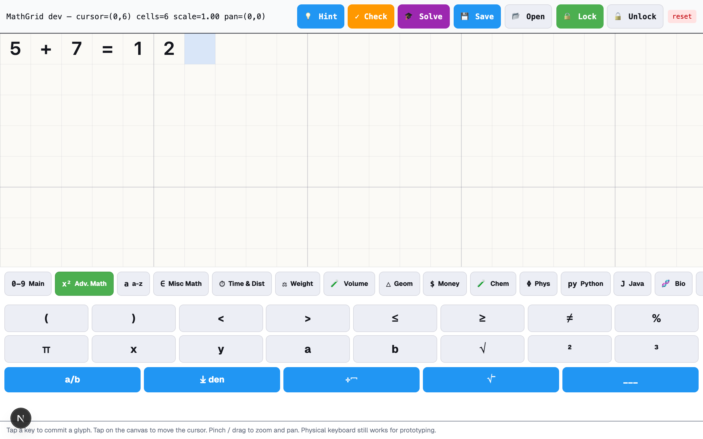

# Prism AAC

**Help nonverbal kids talk.**

Augmentative & Alternative Communication app for children with motor impairments and complex communication needs. Tap pictures, build sentences, hear them spoken aloud — in 16+ languages. Works on any tablet or laptop.

Part of the [Synalux platform](https://synalux.ai).

<p align="center">
  <a href="https://prism-aac.vercel.app"></a>
  <a href="https://synalux.ai/pricing"></a>
  <a href="LICENSE"></a>
</p>

---

## What Prism AAC does

### 🖼 Pictures → words → speech
Tap PECS-style picture tiles to build sentences. The app reads them aloud in your child's language with a natural neural voice (Inworld 2.0).

### ⌨️ Type, predict, speak
Built-in keyboard with word prediction. Smart suggestions learn from how the child communicates over time.

### 📚 Full high-school curriculum on a cell-grid canvas
**Math + Chemistry + Physics + Biology + Statistics + Programming (Python/Java) + Music + Earth Science + History + Language Arts** — all on the same graph-paper canvas, each with a domain-aware AI tutor. History is locale-aware: a child in Romania sees Stephen the Great + 1989 Revolution, in Texas sees the Alamo + JFK, in Catalonia sees Crown of Aragon + 2017 Referendum. **230+ sub-national regions across 23 countries.** [See the math module →](#math-module-cell-grid-canvas)

### 🗓 Visual schedule
Picture-based routines with rewards. Reduces transition anxiety for children with autism.

### 🎮 Therapeutic games
9 evidence-based AAC games (Bubble Pop, Color Hunt, My Story, Match It, Yes/No, Finish It, Category Sort, Emotion Match, What Comes Next). Built to teach communication, not for screen-time.

### 👋 Hands-free with gestures
Optional gesture recognition for users who can't reliably tap. Camera-based, runs locally — no video leaves the device.

### 🩺 Clinical-grade
Designed with BCBAs and SLPs. Verbal operant tracking. Caregiver notes that travel between home, school, and clinic. AGPL-3.0 — free to self-host.

---

## Why PrismAAC is different

**Three things no other AAC app on the market does together:**

### 1. On-device + HIPAA-safe by default
The 7B model that powers AAC suggestions runs **on your device** — iPad, Mac, or laptop. No PHI leaves the device for the speech path. Caregiver notes encrypt before any optional cloud sync. Comparable cloud-only AAC platforms (TouchChat, Proloquo2Go cloud sync) require account uploads to function. We don't.

### 2. Phrase ranking that adapts to YOUR child
Static frequency lists are obsolete. PrismAAC ranks suggested phrases via [**Prism v14.0.0 spreading activation**](https://github.com/dcostenco/prism-coder/blob/main/docs/WOW_FEATURES.md) — the same ACT-R cognitive memory model behind decades of Carnegie Mellon research. Recency × frequency × per-user history, not a static popularity list. Phrases the child says today rise; phrases unused for a year fade (lesson-rate decay `d=0.25`, ~1-year half-life).

### 3. Caregiver corrections become training data — automatically
When a caregiver fixes a suggestion the model got wrong (e.g. "no, the word is *eat*, not *want*"), the [audit-hooks postflight harvester](https://github.com/dcostenco/prism-coder/blob/main/docs/WOW_FEATURES.md#7-the-recipe-combining-all-of-the-above) extracts the gotcha and persists it. After ~50 sessions, the system warns *before* the model makes a similar mistake. No labelling work for caregivers, no expensive retraining runs — the corrections are the curriculum.

**Honest scope:** the underlying 7B model is mid-tier on standard tool-call benchmarks (BFCL V4 overall 18.77%, like the rest of the 7B class). What makes PrismAAC defensible isn't the model alone — it's the model plus the surrounding Prism algorithm stack. That combination is the wow.

---

## Math module (cell-grid canvas)

Math in AAC has historically meant either typing LaTeX — impossible for non-readers — or drawing on a freeform whiteboard that no AI can interpret. PrismAAC takes a third path: a **cell-grid model** where every glyph occupies one snap-aligned cell. The child types on a soft keyboard, the cursor advances predictively (column-add carry rules, fraction numerator → denominator, long-division quotient, exponent), and the on-screen layout is automatically structured enough for an AI tutor to read back.

The same canvas hosts **19 subject keyboards** covering the full high-school program: math + sciences + programming + arts + humanities. Each tab routes the AI tutor through a domain-specific prompt template (33 templates total) so the model doesn't apply algebraic reasoning to a Punnett square or mistake a music dynamic for a programming literal.

### Canvas + main keyboard


The HUD shows live cursor position, cell count, and viewport state. Each digit/operator lands in its own cell — the cursor (highlighted blue) automatically moves to the next slot. Pinch-zoom and one-finger pan work on the canvas; the keyboard region is a fixed-height shell below.

### 19 keyboard categories
Tap a chip to swap the row below. Categories:

**Math (9 keyboards)** — Main (digits + operators), Adv. Math (π √ exponents + 5 decoration tools: fraction box, long-division house, root bar, summation line, fraction bar), a–z, Misc Math (set theory + logic), Time & Dist, Weight, Volume, Geom, Money.

**Sciences (4)** — Chemistry (24 elements + reaction arrows + charges + subscripts + phase markers), Physics (full Greek + 16 SI units + ∫/∂/∇/∑/∏ + constants), Biology (DNA/RNA + genetics + 8 taxonomy ranks + 12 organelles), Statistics (μ σ x̄ + 12 ops + distributions).

**Programming (2)** — Python (24 ops/brackets + 26 keywords) and Java (24 ops + 26 keywords). Code commits one character per cell so it lays out naturally on the monospace grid.

**Arts + Humanities (4)** — Music (3 clefs + 6 notes + 5 rests + 5 accidentals + 8 dynamics), Earth Science (weather + plates + 10 planets + AU/ly/pc/Mya/Gya), History (locale + region aware), Language Arts (12 POS tags + 6 sentence types + punctuation + citation styles).



### AI tutor — Hint / Check / Solve, domain-aware


Three modes: 💡 **Hint** (gentle next-step nudge, never solves), ✓ **Check** (validates the child's answer, celebrates if correct), 🎓 **Solve** (full step-by-step walkthrough, max 4 steps). The active tab tells the tutor what subject the child is on — chemistry, Python, biology, statistics, history (with locale + region!) — so the prompt is specific enough that the model doesn't confuse domains. 11 domains × 3 modes = 33 prompt templates. The expression is serialised row-major and sent to `askAI`, which routes through Synalux. Hard 15 s timeout in the UI plus a Retry button so the overlay never gets stuck on "Thinking…".

### Sciences — Chemistry · Physics · Biology · Statistics


### Programming — Python + Java


### Music notation


### History — locale-aware + region-aware
History is more nuanced than a single global event list — every curriculum is national first, then regional. PrismAAC layers three tiers:

1. **Universal** events taught in every curriculum (476 fall of Rome, 1914 WWI, 1939 WWII, 1969 moon landing).
2. **National** events selected by `language` (en → Norman Conquest + Magna Carta + US Independence; ro → Stephen the Great + 1989 Revolution; hi → Mauryan + Mughal + 1947; ja → Heian + Edo + Meiji; zh → Tang/Ming/Qing + 1949). 19 supported languages.
3. **Sub-national** events selected by `historyRegion` (US-TX → Alamo + JFK; CA-QC → Plains of Abraham + Quiet Revolution; UK-SCT → Bannockburn + Acts of Union; ES-CT → Crown of Aragon + 1714 + 2017 Referendum; IN-MH → Shivaji coronation; DE-BY → Wittelsbach). **230+ regions across 23 countries** including all 50 US states, 13 Canadian provinces/territories, all 4 UK nations, Ireland (Republic + 4 historical provinces), all 16 German Länder, all 17 Spanish autonomous communities, all 20 Italian regions, plus AU, FR, MX, BR, IN, CN, RU, BE, CH, NL, AR, ZA, KR, PK, NZ, PL.

The tutor prompt carries the locale + region so an ambiguous date like 1836 in `US-TX` resolves to the Alamo (not Alabama statehood); 1759 in `CA-QC` anchors to the Plains of Abraham; 1714 in `ES-CT` to the fall of Barcelona.


### Save / Open with portal sync


Local-first: docs persist to `localStorage` so a flaky network never blocks the child. Best-effort sync to Synalux portal happens fire-and-forget; `↻ Sync` pulls every doc the signed-in user owns from the portal and merges by `updatedAt`. Cap is 100 docs / 200 KB body; oldest evicted on overflow.

### Two-hit magnify (accessibility)


For users with motor imprecision, enable two-hit magnify in Settings: the FIRST tap on any math key arms it (1.4× scale + green halo, no commit), the SECOND tap commits. 2 s of inactivity auto-disarms. Composes with hold-time dwell — both can be on at once. Pairs with the green progress ring shown by `DwellButton` during a held-tap.

### Lock-equation tool


After a child finishes solving a problem, tap **Lock**, then two corners of the region. Locked cells render slightly dimmed and reject edits — useful when working on multi-part homework where earlier work shouldn't be accidentally overwritten. Tap **Unlock** to release.

---

## Try it

| | |
|---|---|
| 🌐 **Web app** | [prism-aac.vercel.app](https://prism-aac.vercel.app) — try in any browser |
| 📱 **iOS** | TestFlight (request invite via [synalux.ai/contact](https://synalux.ai/contact)) |
| 💻 **Source** | This repo. AGPL-3.0 — fork freely, share modifications |

---

## Plans

| | Free | Paid |
|---|---|---|
| Picture tiles + 22 categories | ✅ | ✅ |
| Type-to-speak | ✅ | ✅ |
| Default voice (Inworld) | ✅ | ✅ |
| Math panel | ✅ basic | ✅ + AI tutor |
| Schedule | ✅ | ✅ + reward shop |
| Games | 3 (Bubble Pop, Color Hunt, My Story) | All 9 |
| Voice picker | — | ✅ all Inworld voices |
| Voice cloning (your own voice) | — | ✅ |
| Caregiver notes sync | — | ✅ |
| Word prediction (per-user learning) | — | ✅ |

[See Synalux pricing →](https://synalux.ai/pricing)

---

## Clinical safety

Prism AAC is built on these commitments:

- **AAC access is never restricted as a consequence.** A child must always have their voice.
- **No PHI in the cloud without consent.** Caregiver notes encrypt before upload.
- **Audio stays local.** Voice input transcribes in the browser via Whisper WASM.
- **Designed by BCBAs.** Verbal operant tracking matches BACB Task List 5th Edition.
- **Trauma-informed defaults.** No punishment mechanics. Reward shop is opt-in.

Read more: [`ACCESSIBILITY.md`](ACCESSIBILITY.md), [`SECURITY.md`](SECURITY.md).

---

## Self-host

```bash
git clone https://github.com/dcostenco/prism-aac.git
cd prism-aac
npm install
npm run dev    # http://localhost:3000
```

Synalux operates the canonical hosted version (free + paid). Self-hosters and forks must release modifications under AGPL-3.0.

---

<details>
<summary>📚 Tech architecture (model routing, voice, gesture recognition, build details)</summary>

**Stack**: Next.js, Zustand, Whisper WASM (transcription), Inworld TTS-2 + Azure Neural fallback (speech), Kokoro-82M offline TTS, FaceLandmarker (gestures).

**Model routing** (server-side via Synalux portal):
- Free tier (chat): prism-coder:7b local for simple AAC → Gemini 2.5 Flash for medium/complex
- Paid tiers (chat): prism-coder:7b for short → prism-coder:14b (32K ctx) for medium → **Claude Sonnet 4** for complex
- Anthropic outage fallback: Standard → Gemini 3 Flash Preview, Advanced/Enterprise → Gemini 3 Pro Preview (preserves tier quality on cloud failover)
- Autocorrect + word prediction (every keystroke pause): **Gemini 2.5 Flash-Lite** — bench-validated multilingual (ro/ru/es), 752ms avg, 4.3× cheaper than 2.5 Flash
- Speed-critical paths (button tap → speech) bypass routing — never blocks on network

**Voice (TTS)** fallback chain:
- Tier 1: Inworld TTS-2 (paid all langs; free for ro/uk/ru/de/ko/ar where Synalux absorbs cost)
- Tier 1.5: Kokoro-82M neural offline (en/es/fr/pt/ja/zh)
- Tier 2: OS Web Speech API premium voices (offline)
- Tier 3: WASM espeak-ng (last resort)

**Gesture recognition**:
- Basic: head pose + dwell-click via FaceLandmarker
- Advanced: hand pose via MediaPipe; per-user gesture profiles

**Architecture**: modal-only navigation (no router), theme via tokens.bg/text/border/accent.

**Detailed docs in this repo:**
- [`docs/TTS-ARCHITECTURE.md`](docs/TTS-ARCHITECTURE.md) — full speech routing
- [`docs/GESTURE_RECOGNITION.md`](docs/GESTURE_RECOGNITION.md) — gesture mode internals
- [`docs/ADAPTIVE-ENGINE-BEHAVIOR.md`](docs/ADAPTIVE-ENGINE-BEHAVIOR.md) — auto-tone switching
- [`docs/EMERGENCY-NATIVE-ARCHITECTURE.md`](docs/EMERGENCY-NATIVE-ARCHITECTURE.md) — life-critical alert path
- [`docs/SELF-LEARNING-SAFETY.md`](docs/SELF-LEARNING-SAFETY.md) — per-user learning guardrails
- [`docs/TRACKING_RELIABILITY.md`](docs/TRACKING_RELIABILITY.md) — head/hand tracking reliability harness
- [`PRECISION_TOUCH.md`](PRECISION_TOUCH.md) — touch-target accessibility
- [`ACCESSIBILITY.md`](ACCESSIBILITY.md) · [`SECURITY.md`](SECURITY.md) · [`GOVERNANCE.md`](GOVERNANCE.md) · [`AGENTS.md`](AGENTS.md)
- [`RESEARCH.md`](RESEARCH.md) — evidence base
- [`CHANGELOG.md`](CHANGELOG.md) — version history

**The original 900-line README is preserved in git history.** To recover any specific section (math panel deep-dive, prism-coder:14b release notes, full feature tier table, competitive analysis): `git show HEAD~1:README.md`.

</details>

---

## License

[AGPL-3.0](LICENSE) — open source, OSI-approved, grant-eligible.

You're free to fork and self-host. The license requires you to share modifications under AGPL-3.0 too — that's the deal that keeps AAC innovation in the open and accessible to families.
